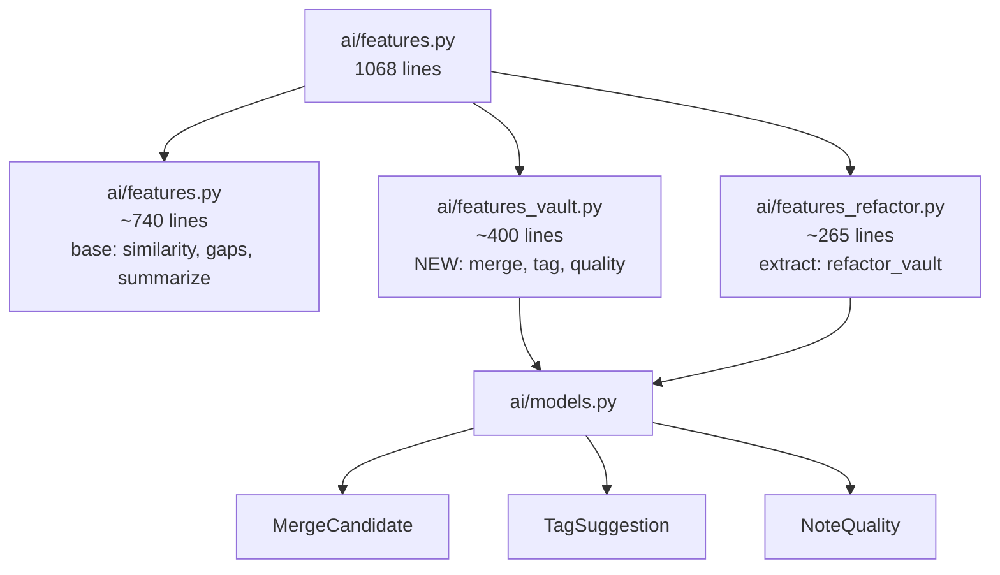

# SPEC: v3.2.0 — Quality Features

> **Status:** draft
> **Created:** 2026-03-06
> **From Brainstorm:** `BRAINSTORM-v3.2.0-quality-features-2026-03-06.md`
> **Target Version:** v3.2.0

---

## Overview

v3.2.0 adds three new AI commands for vault quality management: `merge-suggest` (detect near-duplicate notes), `tag-suggest` (AI-powered tag recommendations), and `quality` (note quality scoring). Also refactors the growing `features.py` into focused modules. Targets large vaults (500-2000 notes) with batch-optimized processing.

---

## Primary User Story

**As a vault owner with 500+ notes**, I want to detect duplicate content, get tag suggestions for untagged notes, and see quality scores for my notes, so I can maintain a well-organized knowledge base without manual review of every note.

### Acceptance Criteria

- [ ] `obs ai merge-suggest <vault>` identifies note pairs with >80% cosine similarity
- [ ] `obs ai tag-suggest <vault>` suggests tags for untagged notes with confidence scores
- [ ] `obs ai quality <vault>` scores every note 0-100 across 4 dimensions
- [ ] All 3 commands support `--json` output
- [ ] All 3 commands support `--verbose` flag
- [ ] Single-note variants: `obs ai tag-suggest <note_id>`, `obs ai quality <note_id>`
- [ ] `--apply` flag on `tag-suggest` auto-applies tags with >80% confidence
- [ ] Existing 236 tests still pass + 12+ new tests
- [ ] Performance: <30s for 1000-note vault (embedding cache warm)

---

## Secondary User Stories

**As a vault owner**, I want to review merge candidates one at a time with overlapping section details, so I can make informed decisions about which notes to consolidate.

**As a vault owner**, I want tags auto-applied when confidence is very high (>80%), so I don't have to manually tag obvious cases.

---

## Architecture

### Module Split



### Three-Layer Integration

```
Presentation (obs.zsh)
    → merge-suggest|tag-suggest|quality cases
    → calls Python CLI

Application (obs_cli.py)
    → argparse subcommands
    → calls features_vault functions
    → Rich output formatting

Data (features_vault.py)
    → merge_suggest_vault() → MergeCandidate[]
    → tag_suggest_vault() → TagSuggestion[]
    → note_quality_vault() → NoteQuality[]
    → uses db_manager, embedding cache, AI client
```

---

## API Design

### New CLI Commands

| Command | Arguments | Flags | Output |
|---------|-----------|-------|--------|
| `obs ai merge-suggest <vault>` | vault name/ID | `--threshold 0.8`, `--json`, `-v` | Merge candidate pairs |
| `obs ai tag-suggest <vault>` | vault name/ID | `--apply`, `--min-confidence 0.6`, `--json`, `-v` | Tag suggestions per note |
| `obs ai tag-suggest <note_id>` | note ID | `--apply`, `--json`, `-v` | Tags for single note |
| `obs ai quality <vault>` | vault name/ID | `--json`, `-v` | Quality scores per note |
| `obs ai quality <note_id>` | note ID | `--json`, `-v` | Quality for single note |

### Python API

```python
# ai/features_vault.py

def merge_suggest_vault(
    vault_id: str,
    db_manager,
    provider: Optional[str] = None,
    threshold: float = 0.8,
    verbose: bool = False,
) -> List[MergeCandidate]:
    """Scan vault for near-duplicate notes using pairwise cosine similarity."""

def tag_suggest_vault(
    vault_id: str,
    db_manager,
    provider: Optional[str] = None,
    min_confidence: float = 0.6,
    apply: bool = False,
    verbose: bool = False,
) -> List[TagSuggestion]:
    """Suggest tags for untagged notes using content + neighbor analysis."""

def tag_suggest_note(
    note_id: str,
    db_manager,
    provider: Optional[str] = None,
    apply: bool = False,
    verbose: bool = False,
) -> TagSuggestion:
    """Suggest tags for a single note."""

def note_quality_vault(
    vault_id: str,
    db_manager,
    verbose: bool = False,
) -> List[NoteQuality]:
    """Score every note in vault across 4 quality dimensions."""

def note_quality(
    note_id: str,
    db_manager,
    verbose: bool = False,
) -> NoteQuality:
    """Score a single note."""
```

---

## Data Models

### New Dataclasses (in `ai/models.py`)

```python
@dataclass
class MergeCandidate:
    note_a_id: str
    note_b_id: str
    note_a_title: str
    note_b_title: str
    similarity: float               # 0.0-1.0 cosine similarity
    shared_links: List[str]         # wikilinks in common
    shared_tags: List[str]          # tags in common
    overlapping_sections: List[str] # section headings that overlap
    suggested_target: str           # ID of note to keep
    confidence: float               # 0.0-1.0

    def to_dict(self) -> dict: ...

    @classmethod
    def from_dict(cls, data: dict) -> 'MergeCandidate': ...

@dataclass
class TagSuggestion:
    note_id: str
    note_title: str
    suggested_tags: List[Dict[str, Any]]  # [{tag, confidence, vault_usage_count}]
    existing_tags: List[str]
    neighbor_tags: List[str]

    def to_dict(self) -> dict: ...

    @classmethod
    def from_dict(cls, data: dict) -> 'TagSuggestion': ...

@dataclass
class NoteQuality:
    note_id: str
    note_title: str
    overall_score: float            # 0-100
    dimensions: Dict[str, float]    # completeness, connectivity, metadata, freshness
    issues: List[Dict[str, str]]    # [{severity: "high"|"medium"|"low", description: str}]
    suggestions: List[str]

    def to_dict(self) -> dict: ...

    @classmethod
    def from_dict(cls, data: dict) -> 'NoteQuality': ...
```

---

## Dependencies

| Dependency | Usage | Status |
|------------|-------|--------|
| numpy | Vectorized pairwise similarity | Already optional (used by embeddings) |
| Rich | CLI output formatting | Already installed |
| NetworkX | Graph metrics for quality scoring | Already installed |
| sqlite3 | Embedding cache, note data | Standard library |

No new dependencies required.

---

## UI/UX Specifications

### Human-Readable Output

#### merge-suggest

```
🔗 Merge Candidates: MyVault
━━━━━━━━━━━━━━━━━━━━━━━━━━━━━━━━━━━━
📊 Scanned 847 notes, found 6 pairs

1. "API Authentication" + "OAuth Setup Guide"
   Similarity: 87%  ████████▓░
   Shared links: 4 | Shared tags: 2
   Overlapping: "Bearer token flow", "Token refresh"
   → Keep: "API Authentication" (longer, more links)

2. "Meeting Notes Nov 3" + "Meeting Notes Nov 4"
   Similarity: 82%  ████████░░
   Shared links: 1 | Shared tags: 3
   → Keep: "Meeting Notes Nov 4" (more recent)

📋 Summary: 6 pairs (2 high confidence, 4 medium)
```

#### tag-suggest

```
🏷️ Tag Suggestions: MyVault
━━━━━━━━━━━━━━━━━━━━━━━━━━━━━━━━━━━━
📊 Found 23 untagged notes, suggesting tags for 18

🟢 AUTO-APPLY (confidence >80%):
  1. k8s-networking.md → #kubernetes (95%), #networking (88%)
  2. docker-compose.md → #docker (92%), #devops (85%)

🟡 REVIEW (confidence 60-80%):
  3. meeting-notes.md → #meetings (72%), #project-alpha (64%)
  ...

📋 Summary: 18 notes, 42 tag suggestions
   Auto-applied: 8 tags (--apply flag)
```

#### quality

```
📊 Quality Scores: MyVault
━━━━━━━━━━━━━━━━━━━━━━━━━━━━━━━━━━━━
📊 Scored 847 notes | Vault average: 64/100

🔴 LOW QUALITY (score <40):
  1. meeting-2025-11-03.md    24/100  ██░░░░░░░░
     Issues: orphan, no tags, very short (89 words)
  2. scratch-ideas.md         31/100  ███░░░░░░░
     Issues: no links, no headings

🟡 NEEDS IMPROVEMENT (40-70):
  3. api-design.md            58/100  █████▓░░░░
     Issues: no tags, stale (>90 days)
  ...

📋 Summary: 12 low, 34 needs improvement, 801 good
```

### Accessibility

- N/A — CLI only, no web UI
- Rich Console handles terminal width adaptation
- Color is supplemented by text labels and score numbers

---

## Open Questions

1. **Tag application mechanism:** Should `--apply` modify the markdown file directly (insert/update YAML frontmatter)? Or output a script the user runs? Direct modification is simpler but riskier.
2. **Merge execution:** v3.2.0 only suggests merges — actual file merging deferred to v3.3.0 (interactive dashboard). Confirm this scope boundary.

---

## Review Checklist

- [ ] Data models have `to_dict()` and `from_dict()` for JSON serialization
- [ ] All new functions follow existing patterns in `features.py`
- [ ] Embedding cache is reused (not rebuilt per command)
- [ ] `--json` output matches existing command patterns
- [ ] ZSH wiring follows existing `obs_ai()` case statement pattern
- [ ] Tests mock AI providers (no real API calls)
- [ ] Performance tested with 1000+ note vault fixture
- [ ] Version bumped in all 11 files
- [ ] Documentation updated (usage.md, cookbook.md, refcard.md, cli-reference.md)

---

## Implementation Notes

### Performance-Critical: Pairwise Similarity

The merge-suggest command needs O(n^2) pairwise comparison. For 1000 notes:

```python
# Batch load all embeddings
embeddings = db_manager.get_all_embeddings(vault_id)  # Single query
matrix = np.array([e['vector'] for e in embeddings])

# Vectorized pairwise cosine similarity
norms = np.linalg.norm(matrix, axis=1, keepdims=True)
normalized = matrix / norms
similarity_matrix = np.dot(normalized, normalized.T)

# Extract pairs above threshold
pairs = np.argwhere(similarity_matrix > threshold)
# Filter: upper triangle only (avoid duplicates), exclude self-pairs
```

This runs in <1s for 1000 notes on modern hardware.

### Tag Suggestion Pipeline

1. **Content analysis:** AI extracts topic keywords from note content
2. **Neighbor propagation:** Tags from linked notes weighted by link count
3. **Vault frequency:** Boost tags that are commonly used in the vault
4. **Confidence scoring:** Weighted average of content (40%), neighbor (35%), frequency (25%)
5. **Apply logic:** If `--apply` and confidence >80%, write tag to YAML frontmatter

### Quality Scoring Dimensions

| Dimension | Weight | Metrics |
|-----------|--------|---------|
| Completeness | 30% | Word count vs vault average, has headings, has content beyond frontmatter |
| Connectivity | 30% | Outgoing links, incoming links, not orphan |
| Metadata | 20% | Has tags, has frontmatter, descriptive title |
| Freshness | 20% | Last modified within 90 days, not stale |

### Implementation Increments

**Increment 1:** Data models + module extraction (~2h)
- Add `MergeCandidate`, `TagSuggestion`, `NoteQuality` to `ai/models.py`
- Extract `refactor_vault()` to `ai/features_refactor.py`
- Tests: 4 new (model serialization, import validation)

**Increment 2:** `merge-suggest` command (~4h)
- `merge_suggest_vault()` in `ai/features_vault.py`
- CLI wiring in `obs_cli.py` + ZSH
- Tests: 4 new (basic, threshold, empty vault, JSON output)

**Increment 3:** `tag-suggest` command (~4h)
- `tag_suggest_vault()` and `tag_suggest_note()` in `ai/features_vault.py`
- `--apply` flag with YAML frontmatter modification
- CLI wiring
- Tests: 4 new (basic, apply, confidence filter, single note)

**Increment 4:** `quality` command (~3h)
- `note_quality_vault()` and `note_quality()` in `ai/features_vault.py`
- Graph-only scoring (no AI calls needed)
- CLI wiring
- Tests: 4 new (basic, dimensions, single note, JSON output)

**Increment 5:** Docs + release (~2h)
- Update usage.md, cookbook.md, refcard.md, cli-reference.md, testing overview
- Version bump to 3.2.0 across 11 files
- Release PR

---

## History

| Date | Author | Change |
|------|--------|--------|
| 2026-03-06 | Claude (max brainstorm) | Initial draft from `/workflow:brainstorm deep feat save` with 2 expert agents |
