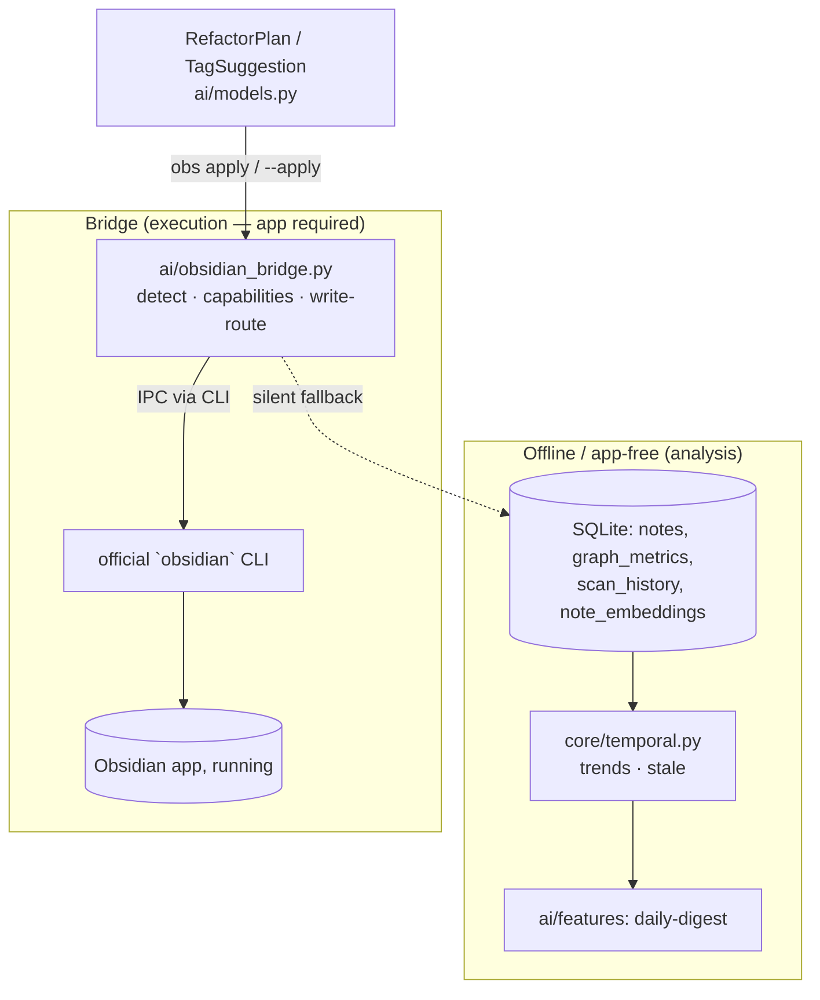

# SPEC: v3.3.0 — Integration Bridge + Temporal Analytics

**Status:** draft
**Created:** 2026-06-04
**Type:** feature (multi-theme release)
**From brainstorm:** `/workflow:brainstorm -d --save` ("brainstorm v3.3.0 features; research the latest official obsidian cli and check for overlap")
**Trigger:** On **2026-02-27, Obsidian 1.12.4** shipped an official, free CLI (now ~115 commands) covering primitive vault operations (search, tags, backlinks, orphans, deadends, unresolved, note CRUD, daily notes, tasks, properties). This forces a strategic decision for `obs`: stop duplicating primitives, double down on the moat (graph + AI + temporal), and **consume** the official CLI rather than compete with it.

---

## Overview

`obs` v3.2.0 is a graph-and-AI analysis engine for Obsidian vaults. The official Obsidian CLI now owns the *primitive* layer `obs` partially duplicated — but it does **no** graph metrics, AI/semantic analysis, embeddings, quality scoring, temporal trends, or cross-vault work, and it **requires the app running**. `obs` keeps a durable moat in all of those.

v3.3.0 advances two confirmed themes:

- **Theme A — Integration Bridge ("brain + hands").** `obs` analyzes and *suggests* today but cannot *execute* (advisory-only by design). The official CLI is the missing hands (`create`, `append`, `property:set`, tag rename). Pairing them turns every `obs` "suggest" command into an optionally-actionable one — without `obs` ever owning risky file-mutation logic.
- **Theme B — Temporal Analytics.** `obs` already captures `scan_history` + per-note `created_at/modified_at/scanned_at`. Surfacing knowledge-evolution intelligence (growth, velocity, importance-ranked staleness, daily digest) is cheap and is something the official CLI structurally cannot do.

**Strategic boundary:** All *analysis* stays offline / app-free. Only *execution* (write-back) needs the Obsidian app running, and every bridge call degrades silently when the official CLI or app is absent (mirrors the existing `ai/obsidian_bridge.py` fallback pattern).

---

## Sequencing & Relationship

> **This spec ships SECOND — after `SPEC-dependency-bootstrapping-2026-06-04.md`.**

- **No functional overlap.** The dependency-bootstrapping spec fixes *how existing core deps get installed* (a P0 startup crash on clean Homebrew installs); this spec adds features and **introduces no new dependencies** — so it never widens the dependency surface that spec is hardening.
- **Foundation dependency (one-way).** Every command below inherits that startup crash until provisioning is fixed, so it must land first. Building v3.3.0 on an install that dies on `import rich` would leave these features unreachable on fresh machines.
- **Inherited safety net.** The CI smoke test from that spec ("clean install → `obs --help` exits 0") should be green before this work merges, and extended to cover the new commands.
- **Different files in shared `obs.zsh`.** That spec edits top-of-file `OBS_PYTHON` resolution; this spec adds dispatcher cases at the bottom — no collision. Release separately (that = patch **v3.2.1**, this = minor **v3.3.0**) on distinct feature worktrees.

---

## Official Obsidian CLI — Overlap Reference

| Zone | Official CLI | `obs` posture |
|---|---|---|
| 🔴 Avoid building | `search`, `read`/`create`/`append`, `daily:*`, `tasks`, `property:set`, `outline` | Delegate; do not reimplement. Drop fuzzy/regex/full-text search from backlog. |
| 🟡 Differentiate | `orphans`, `deadends`, `unresolved`, `tags`, `links`/`backlinks` | Keep, but offline + **graph-importance-enriched** (ranked/scored), not primitive lookups. |
| 🟢 Pure moat | — (none) | Graph metrics, AI/semantic, embeddings, scoring, refactor, **temporal**, cross-vault. v3.3.0 lives here. |

Requires app running (IPC). Sources: [obsidian.md/cli](https://obsidian.md/cli), [obsidian.md/help/cli](https://obsidian.md/help/cli), [kepano/obsidian-skills](https://github.com/kepano/obsidian-skills/blob/main/skills/obsidian-cli/SKILL.md), [Frank Anaya guide](https://frankanaya.com/obsidian-cli/), [DEV announcement](https://dev.to/shimo4228/obsidians-official-cli-is-here-no-more-hacking-your-vault-from-the-back-door-3123).

---

## Primary User Story

**As a** knowledge worker managing an Obsidian vault with `obs`,
**I want** `obs` to (a) act on its own suggestions through the official Obsidian CLI and (b) show me how my vault evolves over time,
**so that** analysis becomes actionable and I can spot importance-weighted decay before it rots my graph.

### Acceptance Criteria

- [ ] `obs bridge status` reports whether the official `obsidian` CLI is installed, its version, and whether the app is running — and exits 0 in all states.
- [ ] `obs apply <plan-file>` is **dry-run by default**, prints each planned action, and only mutates the vault under `--execute` with interactive confirmation; every write routes through the official CLI.
- [ ] `obs ai tag-suggest --apply` actually applies tags via the bridge (today the flag is inert) — or prints a clear "official CLI/app unavailable" notice and falls back to suggestion-only.
- [ ] `obs trends <vault>` renders growth/velocity/heatmap from existing data with **no** new dependency and **no** app required.
- [ ] `obs stale <vault>` ranks notes by **importance × age** (PageRank × days-since-modified), not plain date — output cites the importance signal.
- [ ] `obs ai daily-digest <vault>` composes new-orphans / decayed-hubs / stale-but-important / new-duplicates into one report.
- [ ] All commands support `--json` (project convention) and degrade silently when the bridge is unavailable.
- [ ] Test count increases from 265; pytest run from `src/python/` stays green.

---

## Secondary User Stories

- **As a** scripter, **I want** `obs ai daily-digest --json` on a cron, **so that** I get a machine-readable vault health feed.
- **As a** cautious user, **I want** `apply` to default to dry-run, **so that** I never accidentally mutate notes.
- **As an** offline user, **I want** `trends`/`stale`/`digest-compute` to work with the app closed, **so that** analysis never blocks on Obsidian running.

---

## Command Surface (≈7 new/extended)

### Bridge (Theme A)

1. **`obs bridge status`** — detect official `obsidian` binary + running app; report version/capabilities. New `bridge_status()` in core; extends `ai/obsidian_bridge.py`.
2. **`obs apply <plan-file> [--execute]`** — execute an approved refactor/tag/link plan; each action routed through the official CLI (`property:set`, tag rename, `append`). Dry-run default, interactive confirm. Reuses `RefactorPlan` / `TagSuggestion` in `ai/models.py`.
3. **`obs ai tag-suggest --apply`** — make the existing inert `--apply` real via the bridge write path (per the [ZSH flag-parsing pattern](../../CLAUDE.md): boolean flag, own `while` loop, `shift`).
4. **Read-side enrichment** — alias resolution + accurate backlinks sourced from the official CLI when the app is running; silent fallback to file scan (fixes `graph_builder.py:57` alias TODO).

### Temporal (Theme B) — pure SQLite reads, no AI dependency

5. **`obs trends <vault>`** — knowledge-growth curve, note/link velocity, activity heatmap from `scan_history` + `notes.created_at/modified_at`. New `compute_trends()` in a new `core/temporal.py`.
6. **`obs stale <vault>`** — staleness ranked by importance, joining `graph_metrics.pagerank` × `notes.modified_at`.
7. **`obs ai daily-digest <vault>`** — daily health digest composing existing health + temporal + AI (duplicates) surfaces.

---

## Architecture

- **Three-layer rule preserved** (per `CLAUDE.md`): logic in `core/` + `ai/`; `obs_cli.py` formats with Rich; `obs.zsh` is a thin dispatcher using `/opt/homebrew/bin/python3`.
- **Bridge failure mode:** detection returns a capabilities struct; absent CLI/app → `available=False` → callers fall back (analysis) or print a notice (execution). Reuse the lazy-import + patch-target conventions noted in MEMORY (patch `ai.obsidian_bridge.ObsidianBridge`).

---

## Data Models

Reuse existing `RefactorPlan`, `TagSuggestion`, `NoteQuality` (`ai/models.py`). Add:

- **`TrendReport`** — series of `{date, note_count, link_count, words_added}` + derived velocity + heatmap buckets.
- **`StaleReport`** — list of `{note_title, days_since_modified, pagerank, staleness_score}` sorted by `staleness_score = pagerank × age_factor`.
- **`BridgeStatus`** — `{cli_installed, cli_version, app_running, capabilities[]}`.

No schema migration required — all source columns exist (`notes.created_at/modified_at`, `graph_metrics.pagerank`, `scan_history.*`).

---

## Dependencies

**None new.** The official Obsidian CLI is an **optional external** tool, detected at runtime, never a hard dependency. Temporal features use stdlib + existing `rich`/`networkx`. (Note the separate v3.3.0 packaging fix in `SPEC-dependency-bootstrapping-2026-06-04.md` — provisioning of *existing* core deps; independent of this spec.)

---

## UI/UX Specifications

CLI-only (no GUI). Rich-formatted tables/sparklines for `trends`, importance-ranked table for `stale`, panel digest for `daily-digest`. `apply` shows a dry-run diff-style action list before any `--execute`. All commands honor `--json`. Accessibility: color is decorative only; all signals also conveyed in text (scores, counts, labels).

---

## Open Questions

1. `trends` heatmap in a terminal — Rich sparkline row, or ASCII calendar-heatmap grid? (Lean: sparkline + weekly buckets table.)
2. `apply` plan-file format — accept the JSON that `refactor`/`tag-suggest --json` already emit, or a dedicated plan schema? (Lean: consume existing `--json` output → zero new format.)
3. Should read-side bridge enrichment (alias/backlinks) be opt-in (`--use-obsidian`) or automatic-when-available? (Lean: automatic with silent fallback, `--no-bridge` to force offline.)
4. `daily-digest` "decayed hub / new orphan" deltas need a prior snapshot — derive from `scan_history` + last digest cache, or require two scans? (Lean: diff latest two `scan_history` rows.)

---

## Review Checklist

- [ ] Spec reviewed via `/spec-review`
- [ ] Each command wired across all three layers (zsh → argparse → core/ai) per CLAUDE.md "Adding a New Command"
- [ ] `--json` on every new command
- [ ] Bridge degrades silently (CLI absent / app closed) — covered by tests
- [ ] `apply` dry-run default verified; `--execute` gated by confirmation
- [ ] Tests added under `src/python/tests/`; test count updated in docs + MEMORY
- [ ] Docs updated: cookbook/refcard/usage gain bridge + temporal sections; complementary-tool boundary documented
- [ ] `IDEAS.md` + `MEMORY.md` corrected re: official CLI (~115 cmds, app-required)

## Implementation Notes

- **Build order:** (1) bridge detection/`status` → (2) `trends`+`stale` (independent, quick wins) → (3) `apply`+real `--apply` → (4) `daily-digest` → (5) read-side enrichment.
- Exception narrowing per project pattern: bridge subprocess calls cross an external boundary → broad `except Exception` with graceful fallback is acceptable; SQLite temporal queries → narrow to `sqlite3.OperationalError`/`KeyError`.
- Use `datetime.now(timezone.utc)` (not deprecated `utcnow()`) for any new timestamp math.
- Deferred to v3.4.0+: Theme C (community detection, eigenvector centrality), Theme D watch-daemon + `batch-tag`/`batch-link` (trivial once `apply` lands), cross-vault ops.

## History

- **2026-06-04** — Created from a deep brainstorm triggered by the official Obsidian CLI (1.12.4, 2026-02-27) reaching ~115 commands. Decided scope: Theme A (bridge) + Theme B (temporal), larger multi-theme release. User-confirmed direction and size.
