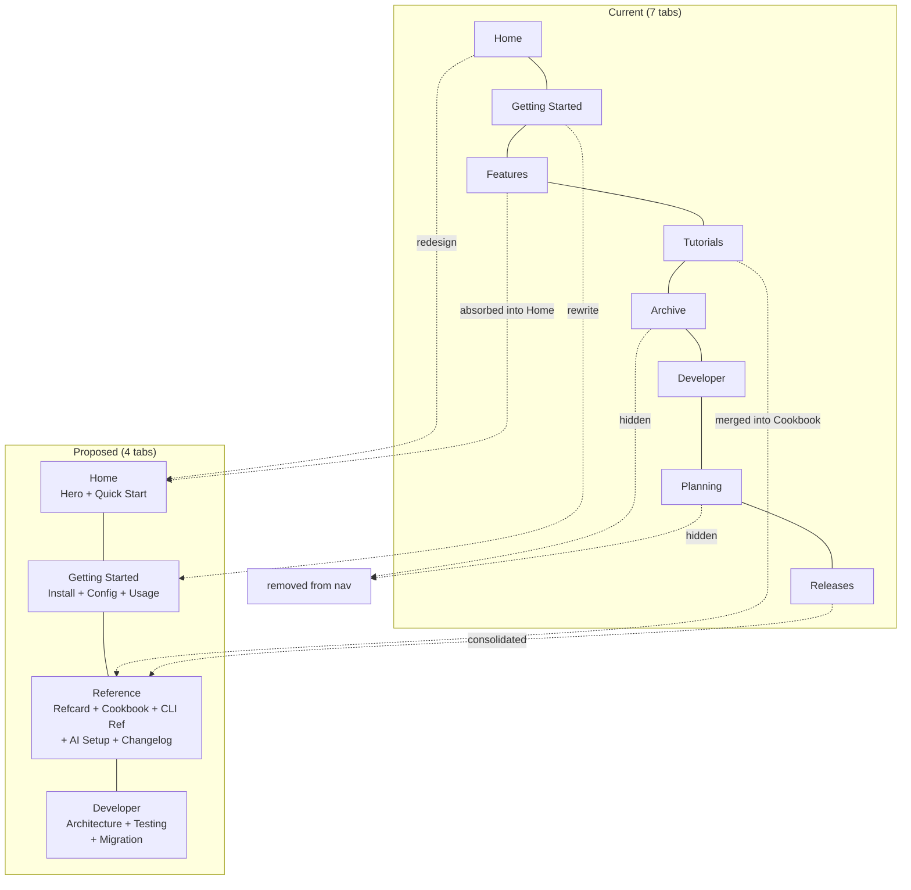

# SPEC: Website Redesign & Stale Docs Audit

**Status:** draft
**Created:** 2026-03-05
**From Brainstorm:** BRAINSTORM-website-redesign-2026-03-05.md
**Site:** https://data-wise.github.io/obsidian-cli-ops/

---

## Overview

Redesign the MkDocs Material documentation site for Obsidian CLI Ops v3.0.0. Simplify navigation from 7 tabs to 4, rewrite stale pages (installation, configuration), replace tutorials with an expanded cookbook, add a hero landing page, and remove internal dev artifacts from the public site. Target audience: mixed (power users, newcomers, developers/contributors).

## Primary User Story

**As a** mixed audience visitor (CLI enthusiast, new Obsidian user, or potential contributor),
**I want** a clean, well-organized documentation site with current v3.0 content,
**so that** I can quickly find what I need — install instructions, command reference, AI setup, or architecture docs.

## Acceptance Criteria

- [ ] Navigation reduced to 4 tabs: Home | Getting Started | Reference | Developer
- [ ] All v2.x references removed from active pages (TUI, `obs manage`, R-Dev)
- [ ] installation.md rewritten with Homebrew + manual install methods
- [ ] configuration.md rewritten with AI provider + shell + advanced config
- [ ] v3.0.md deleted from navigation (file retained)
- [ ] Archive and Planning sections removed from navigation
- [ ] Tutorials merged into expanded cookbook
- [ ] Landing page redesigned with hero section and Mermaid diagram
- [ ] CLI reference promoted from `docs/user/` to site
- [ ] Releases consolidated into single changelog page
- [ ] `mkdocs build` passes clean (no warnings)
- [ ] Site deploys successfully to GitHub Pages

## Secondary User Stories

### Developer/Contributor

**As a** developer exploring the codebase,
**I want** architecture docs and testing guides under a Developer tab,
**so that** I can understand the system and contribute effectively.

### New User

**As a** new Obsidian user discovering `obs`,
**I want** a clear 3-step quick start on the homepage,
**so that** I can go from zero to running in under 5 minutes.

## Architecture



## Navigation Structure (mkdocs.yml)

```yaml
nav:
  - Home: index.md
  - Getting Started:
      - Installation: installation.md
      - Configuration: configuration.md
      - Usage: usage.md
  - Reference:
      - Quick Reference: refcard.md
      - Cookbook: cookbook.md
      - CLI Reference: cli-reference.md
      - AI Setup Guide: ai-setup.md
      - Changelog: changelog.md
  - Developer:
      - Architecture: developer/architecture.md
      - Testing:
          - Overview: developer/testing/overview.md
          - Core Tests: developer/testing/core-tests.md
          - Sandbox: developer/testing/sandbox.md
      - Migration Guide: migration.md
```

## API Design

N/A - No API changes. This is a documentation-only task.

## Data Models

N/A - No data model changes.

## Dependencies

| Dependency | Purpose | Status |
|-----------|---------|--------|
| MkDocs Material | Theme | Already installed |
| pymdownx extensions | Mermaid, tabs, admonitions | Already configured |
| `docs/user/cli-reference.md` | Source for promoted CLI reference | Exists (465 lines) |

## UI/UX Specifications

### Landing Page Wireframe

```
┌──────────────────────────────────────────────────────────┐
│  obs — Your Vault's Command Line                         │
│  15 commands. 5 AI providers. Zero friction.             │
│                                                          │
│  [Install Now]  [Quick Reference]                        │
├──────────────────────────────────────────────────────────┤
│                                                          │
│  ┌─────────────┐ ┌─────────────┐ ┌─────────────┐        │
│  │ Vault       │ │ AI-Powered  │ │ Reorganize   │        │
│  │ Discovery & │ │ Insights    │ │ Your Vault   │        │
│  │ Graph       │ │ (similar,   │ │ (refactor    │        │
│  │ Analysis    │ │ duplicates) │ │  command)    │        │
│  └─────────────┘ └─────────────┘ └─────────────┘        │
│                                                          │
├──────────────────────────────────────────────────────────┤
│  Quick Start                                             │
│  $ brew install data-wise/tap/obsidian-cli-ops           │
│  $ obs discover ~/Documents --scan                       │
│  $ obs health MyVault                                    │
├──────────────────────────────────────────────────────────┤
│  Architecture                                            │
│  [Mermaid: ZSH → Python Core → SQLite]                   │
├──────────────────────────────────────────────────────────┤
│  Footer: GitHub repo link | ISC License                  │
└──────────────────────────────────────────────────────────┘
```

### Page Template (Consistent Structure)

Every content page follows:
```markdown
# Page Title
> One-line description of this page

[Main content sections]

---
## Next Steps
- [Related page 1](link) — what you'll learn
- [Related page 2](link) — what you'll learn
```

### Accessibility Checklist

- [x] Dark/light mode toggle (already configured in Material theme)
- [ ] Alt text for any terminal GIFs added
- [ ] Mermaid diagrams have descriptive captions
- [ ] Code blocks have language identifiers for syntax highlighting
- [ ] Navigation is keyboard-accessible (Material theme default)

## File Changes

### Delete from Navigation (files retained)

| File | Reason |
|------|--------|
| `v3.0.md` | README copy, causes strict-mode warnings |
| `archive/v2.x.md` | Internal dev artifact |
| `archive/v2.0.md` | Internal dev artifact |
| `archive/r-dev.md` | Internal dev artifact |
| `planning/phases/phase1-complete.md` | Internal dev artifact |
| `planning/phases/phase2-complete.md` | Internal dev artifact |
| `planning/phases/phase4-plan.md` | Internal dev artifact |
| `planning/phases/phase4.5-options.md` | Internal dev artifact |
| `planning/phases/phase4.5-complete.md` | Internal dev artifact |

### Rewrite

| File | Lines | Key Changes |
|------|-------|-------------|
| `index.md` | ~154 → ~80 | Hero section, remove phase history, Mermaid diagram |
| `installation.md` | 60 → ~80 | Homebrew + manual, remove TUI/manage refs |
| `configuration.md` | 23 → ~80 | AI providers, shell integration, advanced |
| `cookbook.md` | 180 → ~300 | Absorb tutorial content, add new recipes |

### Create

| File | Purpose |
|------|---------|
| `cli-reference.md` | Promoted from `docs/user/cli-reference.md` |
| `changelog.md` | Consolidated from 3 release pages |

### Modify

| File | Change |
|------|--------|
| `mkdocs.yml` | New 4-tab nav structure |
| `developer/testing/overview.md` | Update test count 186 → 202 |
| `developer/testing/core-tests.md` | Verify accuracy for v3.0 |

## Implementation Increments

### Increment 1: Critical Fixes & Nav Cleanup (~1 hour)

1. Fix `installation.md` — remove TUI, `obs manage`, add Homebrew
2. Fix `configuration.md` — remove R-Dev, add AI config
3. Delete `v3.0.md` from nav, update index.md button
4. Remove Archive + Planning sections from mkdocs.yml nav
5. Validate: `mkdocs build` clean

### Increment 2: 4-Tab Nav Restructure (~2 hours)

1. Restructure mkdocs.yml to 4-tab layout
2. Copy `docs/user/cli-reference.md` → `docs_mkdocs/cli-reference.md`
3. Create `changelog.md` (consolidate 3 release pages)
4. Remove old release pages from nav
5. Validate: all internal links resolve

### Increment 3: Hero Landing Page (~1 hour)

1. Rewrite `index.md` with hero tagline + CTA buttons
2. Add Mermaid three-layer architecture diagram
3. Add 3-step quick start
4. Remove "Project Status" phase history
5. Remove "Documentation" links (nav handles this)

### Increment 4: Cookbook Expansion (~2 hours)

1. Merge `tutorials/getting-started.md` content into cookbook
2. Merge `tutorials/graph-analysis.md` content into cookbook
3. Merge `tutorials/ai-features.md` content into cookbook
4. Add new sections: Getting Started, Advanced Workflows
5. Remove tutorials section from nav
6. Update any cross-references

### Increment 5: Visual Polish (Future Session)

1. Generate terminal GIFs with asciinema/terminalizer
2. Add Mermaid diagrams to AI setup and developer pages
3. Apply consistent page template (intro + content + next steps)
4. Final deploy and validation

## Open Questions

1. **Homebrew formula accuracy** — Is `brew install data-wise/tap/obsidian-cli-ops` the current install command? Need to verify before writing installation page.
2. **Terminal GIF tooling** — Which tool for recording: asciinema, terminalizer, or VHS? (Future increment)

## Review Checklist

- [ ] All v2.x references removed (TUI, R-Dev, `obs manage`, `obs switch`)
- [ ] `mkdocs build` passes with no warnings
- [ ] `mkdocs build --strict` passes clean
- [ ] All internal links resolve
- [ ] Navigation is intuitive for all 3 audience types
- [ ] Code examples use correct v3.0 commands
- [ ] Test counts updated to 202
- [ ] Version references say 3.0.0

## Implementation Notes

- Files removed from nav are **NOT deleted** — they remain in the repo for historical reference
- The `docs/` directory (non-MkDocs) is separate from `docs_mkdocs/` — only `docs_mkdocs/` is served
- Developer/testing pages may need additional review for v3.0 accuracy
- Cookbook should maintain the practical, recipe-based tone of the current version
- Each increment should end with `mkdocs build` validation and deploy

## History

| Date | Change |
|------|--------|
| 2026-03-05 | Initial spec from deep brainstorm session |
