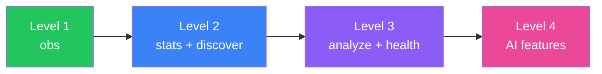

# ADHD Quick Start

> **TL;DR** (30 seconds)
> - **What:** Get productive with `obs` in under 60 seconds
> - **Why:** No docs required — just 3 commands
> - **How:** Copy-paste the commands below
> - **Next:** [Usage Guide](usage.md) when you're ready for more

**Time:** ~1 minute | **Level:** Absolute Beginner | **Steps:** 3

---

## :rocket: First 30 Seconds

```bash
# 1. Install
brew install data-wise/tap/obsidian-cli-ops

# 2. Find your vaults
obs discover ~/Documents --scan

# 3. See what you've got
obs
```

That's it. You're done. Everything below is optional.

---

## :clock3: Next 5 Minutes

### Check a vault's health

```bash
obs stats MyVault
obs health MyVault
```

### Analyze your knowledge graph

```bash
obs analyze MyVault
```

### Set up AI features (optional)

```bash
obs ai setup
```

!!! tip "You don't need AI features to use obs"
    AI features are optional and 100% local. The core vault management works without them.

---

## :sos: Stuck?

### "No vaults found"

```bash
# Check where your vaults actually are
ls ~/Library/Mobile\ Documents/iCloud~md~obsidian/Documents/

# Then discover them
obs discover ~/Library/Mobile\ Documents/iCloud~md~obsidian/Documents --scan
```

### "Command not found: obs"

```bash
source ~/.zshrc
```

### Something else?

```bash
obs help --all
```

---

## :brain: ADHD-Friendly Features

`obs` is designed for how ADHD brains actually work:

| Feature | Why It Helps |
|---------|-------------|
| **One starting command** | `obs` — no decision paralysis |
| **Progressive disclosure** | Learn 1 command, then 3, then 15 |
| **Smart defaults** | iCloud auto-detected, no config needed |
| **Rich output** | Color-coded tables, not walls of text |
| **Flexible lookup** | Use vault name OR ID prefix — whatever you remember |

### The 4-Level Learning Path



**You only need Level 1 to get started.**

---

## :arrow_right: Next Steps

| Ready for... | Go to |
|-------------|-------|
| Daily workflows | [Usage Guide](usage.md) |
| Copy-paste recipes | [Cookbook](cookbook.md) |
| Command lookup | [Quick Reference](refcard.md) |
| AI-powered analysis | [AI Setup Guide](ai-setup.md) |
