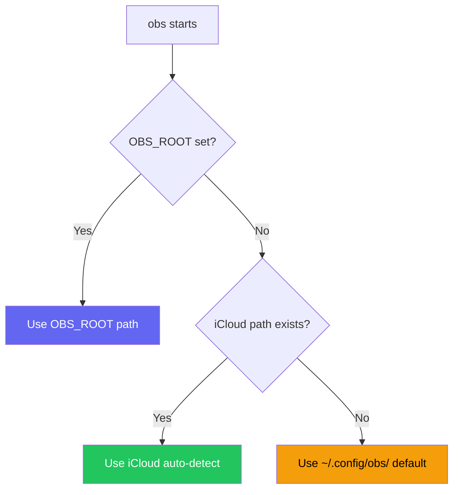

# Configuration

> **TL;DR** (30 seconds)
> - **What:** Optional settings for database, AI providers, and shell integration
> - **Why:** `obs` works out of the box — configure only what you need
> - **How:** iCloud auto-detected; set `OBS_ROOT` to override vault location
> - **Next:** [AI Setup Guide](ai-setup.md) for AI provider configuration
{ .tldr }

**Time:** ~3 minutes | **Level:** Beginner | **Steps:** 3 sections

---

## :floppy_disk: Database Location

The SQLite database is stored at:

```
~/.config/obs/vault_db.sqlite
```

To reinitialize:

```bash
python3 src/python/obs_cli.py db init
```

## :robot: AI Provider Configuration

`obs` supports multiple AI providers with automatic fallback routing:

| Priority | Provider | Type | Setup |
|----------|----------|------|-------|
| 1 | Gemini API | Cloud | `GEMINI_API_KEY` env var |
| 2 | Anthropic API | Cloud | `ANTHROPIC_API_KEY` env var |
| 3 | Ollama | Local | Install [Ollama](https://ollama.com), pull a model |
| 4 | Gemini CLI | Local | Install `gemini` CLI tool |
| 5 | Claude CLI | Local | Install `claude` CLI tool |

### Setting API Keys

```bash
# Add to ~/.zshrc or ~/.zshenv
export GEMINI_API_KEY="your-key-here"
export ANTHROPIC_API_KEY="your-key-here"
```

### Using Ollama (100% Local, Private)

```bash
# Install Ollama
brew install ollama

# Pull a model
ollama pull llama3.2

# Verify
obs ai status
```

### Check Provider Status

```bash
# See which providers are available
obs ai status

# Interactive setup wizard
obs ai setup

# Test all configured providers
obs ai test
```

## :shell: Shell Integration

### Verbose Mode

Add `--verbose` to any command for detailed output:

```bash
obs analyze Knowledge_Base --verbose
```

### Python Interpreter Resolution

As of **v3.2.1**, `obs` runs against an interpreter that has its core deps provisioned in an **isolated venv** — it never silently trusts a bare `python3`. The launcher (`_obs_resolve_python`) resolves in priority order:

1. **`$OBS_PYTHON`** — explicit override (below), or set by the Homebrew formula
2. **install.sh user venv** — `~/.local/share/obs/venv`
3. **Homebrew formula venv** — `libexec/venv`
4. **ambient `python3`** — last resort, with a warning that deps may be missing

To force a specific interpreter (non-standard location, or a venv you manage):

```bash
export OBS_PYTHON=/path/to/python3
```

If you ever see `[obs] WARN: ... ambient python3 ... deps may be missing`, provision an isolated env with `./install.sh` (or `brew reinstall obsidian-cli-ops`). See [Installation](installation.md#how-dependencies-are-provisioned) for the full model.

### iCloud Vault Auto-Detection

`obs` automatically checks the standard Obsidian iCloud path:

```
~/Library/Mobile Documents/iCloud~md~obsidian/Documents
```

To discover vaults elsewhere:

```bash
obs discover ~/Documents --scan
```

## :mag: Config Lookup Order



---

## Next Steps

- [AI Setup Guide](ai-setup.md) -- Detailed provider configuration
- [Usage](usage.md) -- Core commands and workflows
