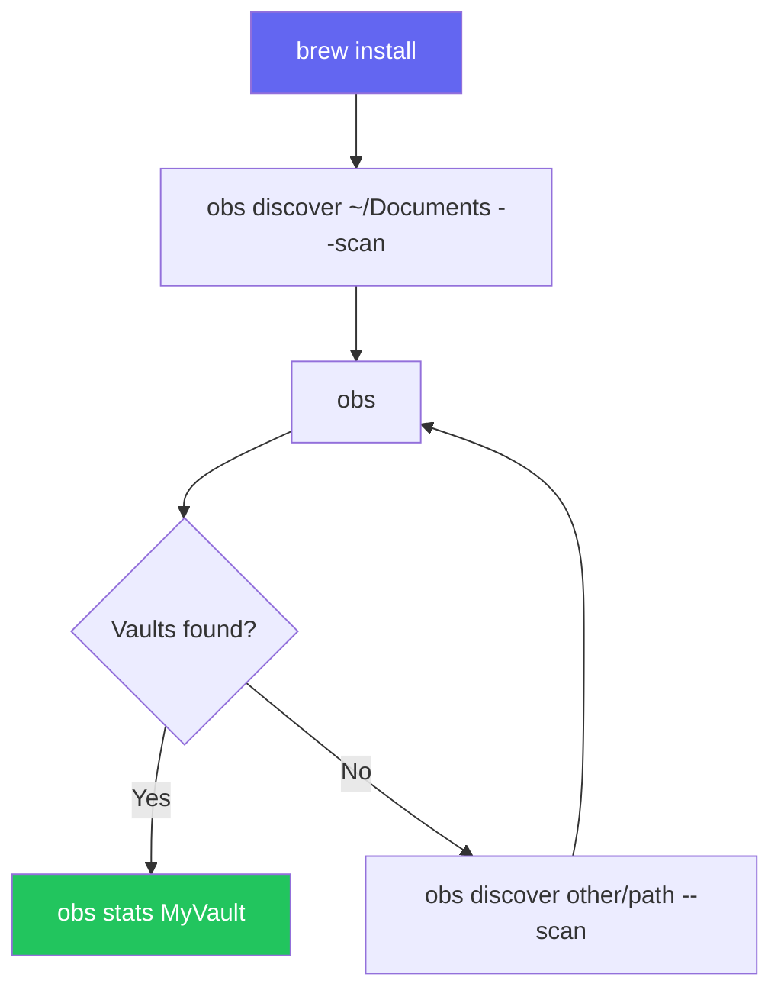
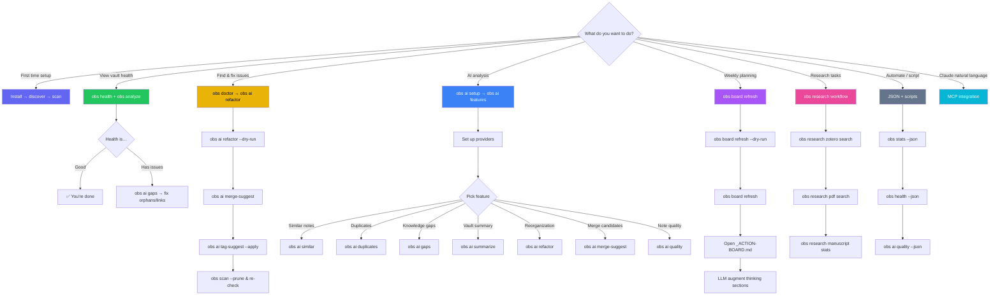

# Cookbook

> **TL;DR** (30 seconds)
>
> - **What:** Task-based recipes for common vault management scenarios
> - **Why:** Copy-paste solutions instead of reading docs
> - **How:** `obs discover ~/Documents --scan` — find and scan vaults in one step
> - **Next:** [AI Setup Guide](ai-setup.md) for AI-powered analysis
{ .tldr }

**Time:** ~15 minutes (all recipes) | **Level:** Beginner–Intermediate | **Steps:** 25+ recipes

---

## First-Time Setup Flow



---

## Vault Health & Cleanup

### Run a full health check

```bash
obs analyze MyVault        # Graph metrics (density, clusters)
obs health MyVault         # Health scores (4 dimensions)
obs ai gaps MyVault        # Knowledge gaps
obs ai refactor MyVault    # Reorganization plan
```

### Find and organize orphaned notes

Orphaned notes have no incoming or outgoing links. They're invisible to graph navigation.

```bash
# See orphan count
obs health MyVault

# Get AI-powered reorganization plan
obs ai refactor MyVault

# Preview scope first (no AI calls)
obs ai refactor MyVault --dry-run
```

**What to do with orphans:**

- Link them to relevant hub notes or MOCs (Maps of Content)
- Some orphans are fine (daily notes, templates)
- High orphan count (>20%) suggests poor linking habits

### Archive stale folders

The refactor command detects folders where all notes are >90 days old with low connectivity:

```bash
obs ai refactor MyVault --json | python3 -c "
import json, sys
plan = json.load(sys.stdin)
for s in plan['suggestions']:
    if s['category'] == 'archive':
        print(f\"Archive: {s['affected_paths']}\")
"
```

### Consolidate small folders

Folders with fewer than 3 notes are flagged for merging:

```bash
obs ai refactor MyVault --json | python3 -c "
import json, sys
plan = json.load(sys.stdin)
for s in plan['suggestions']:
    if s['category'] == 'merge-folder':
        print(s['description'])
"
```

---

## Knowledge Graph Analysis

### Understand graph density

Run `obs analyze MyVault` and check the density value:

| Density | Interpretation |
|---------|---------------|
| < 0.01 | Sparse -- many isolated notes |
| 0.01-0.05 | Typical -- healthy vault |
| 0.05-0.10 | Dense -- well-connected |
| > 0.10 | Very dense -- may have over-linking |

### Find hub notes (most connected)

```bash
obs analyze MyVault --verbose
```

Hub notes are the backbone of your knowledge graph. Review them regularly
-- they influence many notes. Consider splitting hubs with 50+ connections.

### Understand clusters

Clusters are groups of notes more connected to each other than to the rest.
The cluster count in `obs analyze` output tells you how many topic
communities exist:

- Very few clusters (1-2): vault may lack structure
- Many small clusters: topics may not be cross-linked enough
- Each cluster typically represents a topic or project

### Export graph data for external tools

```bash
# All stats as JSON
obs stats --vault MyVault --json > vault_stats.json

# Health scores as JSON
obs health MyVault --json > health.json

# Refactor plan as JSON
obs ai refactor MyVault --json > refactor_plan.json
```

### Track changes over time

Re-scan and re-analyze periodically:

```bash
obs scan /path/to/vault && obs analyze MyVault -v
```

Watch for: orphan count increasing, broken links growing, density increasing (good), new clusters forming.

??? tip "Automate health checks"
    Add `obs health MyVault` to a cron job or shell alias for daily vault monitoring.

---

## AI-Powered Discovery

### Set up AI providers

```bash
# Check what's available
obs ai status

# Run the interactive wizard
obs ai setup

# Test all providers
obs ai test
```

**Quick options:**

- **Fastest (no install):** Use `gemini-cli` or `claude-cli` if you have them
- **Most private:** Use `ollama` for 100% local processing
- **Best quality:** Use `gemini-api` or `anthropic-api` with an API key

### Find related notes you forgot about

```bash
# Find notes similar to a specific note
obs ai similar <note_id> --limit 5

# Suggest links you're missing
obs ai suggest-links <note_id>
```

### Analyze a note in depth

```bash
obs ai analyze <note_id>
```

Returns topics, themes, quality scores, and improvement suggestions.

### Detect duplicate content

```bash
# Scan entire vault
obs ai duplicates MyVault

# Lower threshold catches more near-duplicates
obs ai duplicates MyVault --threshold 0.75
```

Review each pair -- high similarity doesn't always mean duplicate.

### Find knowledge gaps

```bash
obs ai gaps MyVault
```

Detects stub notes (referenced often but underdeveloped), orphaned notes, and structural gaps.

### Get vault-wide themes

```bash
# Full vault summary
obs ai summarize MyVault

# Scoped to a folder
obs ai summarize MyVault --folder "projects/"

# Scoped to a tag
obs ai summarize MyVault --tag "python"
```

### Get reorganization suggestions

```bash
# Full analysis with AI
obs ai refactor MyVault

# Preview scope without AI calls
obs ai refactor MyVault --dry-run

# Machine-readable output
obs ai refactor MyVault --json
```

Suggestion categories: `move` (unsorted notes), `archive` (stale folders),
`merge-folder` (small folders), `create-folder` (scattered tags),
`connect` (orphans near clusters).

!!! warning "AI refactor is read-only"
    The refactor command only **suggests** changes — it never moves or
    deletes your files. Safe to run anytime.

### Find merge candidates

Identify notes with high content similarity that might be consolidated:

```bash
# Default threshold: 80% similarity
obs ai merge-suggest MyVault

# Stricter threshold
obs ai merge-suggest MyVault --threshold 0.9

# JSON for scripting
obs ai merge-suggest MyVault --json | python3 -c "
import json, sys
for c in json.load(sys.stdin):
    print(f\"{c['similarity']:.0%}  {c['note_a_title']} ↔ {c['note_b_title']}\")
"
```

!!! tip "Embeddings required"
    `merge-suggest` uses cached embeddings from the `note_embeddings` table.
    Run `obs ai similar` or `obs ai duplicates` first to populate the cache.

### Suggest tags for untagged notes

```bash
# Vault-wide: suggest tags for all untagged notes
obs ai tag-suggest MyVault

# Single note
obs ai tag-suggest <note_id>

# Auto-apply tags with >80% confidence
obs ai tag-suggest MyVault --apply

# Only show high-confidence suggestions
obs ai tag-suggest MyVault --min-confidence 0.7
```

### Score note quality

Rate every note across 4 dimensions (no AI required — graph-only):

```bash
# Vault-wide: sorted worst-first
obs ai quality MyVault

# Single note
obs ai quality <note_id>

# JSON for dashboards
obs ai quality MyVault --json | python3 -c "
import json, sys
scores = json.load(sys.stdin)
low = [s for s in scores if s['overall_score'] < 30]
print(f'{len(low)} notes need attention (score < 30)')
"
```

Quality dimensions (weighted): completeness (30%), connectivity (30%),
metadata (20%), freshness (20%).

---

## Multi-Vault Management

### Discover all vaults on your system

```bash
# Standard locations
obs discover ~/Documents --scan
obs discover ~/Library/Mobile\ Documents/iCloud~md~obsidian/Documents --scan

# List everything found
obs
```

### Compare vault health across vaults

```bash
for vault in MyVault WorkNotes Research; do
    echo "=== $vault ==="
    obs health "$vault" --json | python3 -c "
import json, sys
h = json.load(sys.stdin)
print(f\"  Overall: {h['overall']}/100\")
"
done
```

### Inspect a single vault's metadata

```bash
# Human-readable panel
obs vault info MyVault

# Machine-readable (id, path, note count, timestamps)
obs vault info MyVault --json
```

### Rename a vault's display name

The path and ID never change, so notes, links, and graph metrics stay intact —
only the label you see in `obs` changes.

```bash
# Rename by current name…
obs vault rename "Untitled" "Research Vault"

# …or by ID prefix
obs vault rename a1b2c3 Archive
```

!!! warning "Collisions are refused"
    `obs vault rename X Y` fails if another vault already uses the name `Y` —
    name-based lookup (`obs stats Y`, `get_vault_stats("Y")`) must stay
    unambiguous.

### Safely remove a vault from the index

Deletion is **index-only** — your markdown files on disk are never touched. The
default is a dry-run; you must pass `--force` to actually delete.

```bash
# 1. Preview what would be removed (nothing changes)
obs vault delete OldVault

# 2. Commit the removal — cascades to notes/links/tags/metrics
obs vault delete OldVault --force

# Re-index any time by re-scanning the folder
obs scan ~/Documents/OldVault
```

### Re-register a vault under a new name

Because delete is index-only and `scan` re-registers by path, you can "reset" a
vault's index without losing files:

```bash
obs vault delete MyVault --force        # drop the stale index
obs scan ~/Documents/MyVault --analyze  # rebuild it fresh
obs vault rename MyVault "My Vault"      # tidy the display name
```

---

## Scripting & Automation

### JSON output for all data commands

Most commands support `--json`:

```bash
obs stats --json                          # Global stats
obs stats --vault MyVault --json          # Vault stats
obs health MyVault --json                 # Health scores
obs analyze MyVault --json                # Graph metrics
obs ai refactor MyVault --json            # Refactor plan
obs ai duplicates MyVault --json          # Duplicate groups
obs ai suggest-links <note_id> --json     # Link suggestions
obs ai gaps MyVault --json                # Knowledge gaps
obs ai summarize MyVault --json           # Vault summary
obs ai merge-suggest MyVault --json       # Merge candidates
obs ai tag-suggest MyVault --json         # Tag suggestions
obs ai quality MyVault --json             # Quality scores
```

### Pipe refactor suggestions to a checklist

```bash
obs ai refactor MyVault --json | python3 -c "
import json, sys
plan = json.load(sys.stdin)
for s in plan['suggestions']:
    priority = {'high': '!!!', 'medium': '!!', 'low': '!'}[s['priority']]
    print(f'- [ ] {priority} {s[\"description\"]}')
" > vault_cleanup_tasks.md
```

---

## Using obs with the Native Obsidian CLI

Obsidian v1.12.4+ ships a [native CLI](https://help.obsidian.md/cli) for
note-level operations (read, create, search, tags). Use it alongside `obs`
for a complete terminal workflow.

!!! tip "Two tools, zero overlap"
    `obs` = graph analysis + AI insights (works offline, reads SQLite).
    `obsidian` = note CRUD + search + tags (requires Obsidian running).

### Quick capture + AI analysis

```bash
# Capture a thought via native CLI
obsidian daily:append content="Idea: refactor auth module to use JWT"

# Later, analyze the vault for related notes
obs ai similar auth-module
obs ai suggest-links auth-module
```

### Find orphans, then fix them

```bash
# obs finds orphans via graph analysis
obs health MyVault              # Shows orphan count
obs ai refactor MyVault         # Suggests where orphans belong

# Native CLI reads/moves the actual files
obsidian read file="stale-idea"
obsidian move file="stale-idea" to="archive/"
```

### Rename tags vault-wide

```bash
# obs shows tag distribution
obs stats MyVault --json | python3 -c "
import json, sys
stats = json.load(sys.stdin)
for tag in stats.get('top_tags', [])[:10]:
    print(f\"  {tag['name']}: {tag['count']} notes\")
"

# Native CLI renames across all files
obsidian tags:rename old=javascript new=js
```

### Daily vault health ritual

```bash
# Morning check (30 seconds)
obs health MyVault                          # Overall scores
obsidian daily                              # Open today's note
obsidian tasks                              # Review open tasks

# Weekly deep dive (5 minutes)
obs ai quality MyVault                      # Worst-scoring notes
obs ai refactor MyVault --dry-run           # Scope check
obs ai gaps MyVault                         # Knowledge gaps
obs analyze MyVault -v                      # Graph metrics
```

### Search + analyze pipeline

```bash
# Native search finds notes by content
obsidian search query="[tag:python]"

# obs finds notes by graph position and AI similarity
obs ai similar python-basics
obs ai suggest-links python-basics
```

### Create notes from AI suggestions

```bash
# obs identifies knowledge gaps
obs ai gaps MyVault --json | python3 -c "
import json, sys
gaps = json.load(sys.stdin)
for g in gaps.get('gaps', [])[:3]:
    print(g['topic'])
"

# Native CLI creates the missing notes
obsidian create name="Missing Topic" template="note-template"
```

??? info "Setup: Enable native CLI"
    Settings → General → Command line interface. Requires Obsidian v1.12.4+ running.

---

## Claude Desktop Integration (v3.3.0)

Once `obs` is connected to Claude Desktop via MCP ([setup guide](claude-integration.md)),
you can use natural language for all vault operations — no terminal required.

### Ask Claude to search your vaults

> *"Search my research vault for causal inference and list the top 5 results"*

Claude calls `search_notes("causal inference", vault_id="Research", limit=5)` and summarizes
the matching notes.

### Ask Claude for a vault health check

> *"Run a health check on MyVault and tell me the top issues to fix"*

Claude calls `get_vault_health("MyVault")` and `get_orphaned_notes` and presents a
prioritized fix list.

### Create notes from conversation

> *"I just had a key insight about collider bias. Create a note called 'Collider Bias Insight
> 2026-06-15' in my research vault with these points: [...]"*

Claude calls `create_note("Research", "Collider Bias Insight 2026-06-15", content=...)`.

### Append to your daily note

> *"Append these meeting notes to today's daily note: [...]"*

Claude looks up the daily note via `search_notes` or `list_notes`, then calls `append_to_note`.

### Insert at a specific heading (surgical edit)

> *"Add this row to the Results table in my sensitivity-analysis note: | OLS | 0.45 | 0.02 |"*

Claude calls `insert_to_note(note_id,
content="| OLS | 0.45 | 0.02 |", after_heading="Results",
as_table_row=True)`.
Only the table is touched — the rest of the note is unchanged.

> *"Replace the Abstract section of my paper draft with this revised version: [...]"*

Claude calls `insert_to_note(note_id, content="...", replace_section="Abstract")`.
Everything between `## Abstract` and the next same-level heading is replaced.

> *"Insert a Limitations section just before References in my collider-bias note"*

Claude calls `insert_to_note(note_id, content="## Limitations\n\n...", before_heading="References")`.

!!! tip "When to use which write tool"
    `append_to_note` → end of file, no structure needed.
    `write_note` → full replacement with auto-backup.
    `insert_to_note` → heading-aware surgical edit
    (table row, section swap, before/after).

### AI analysis via Claude

> *"Find knowledge gaps in MyVault and suggest three new notes I should create"*

Claude calls `run_obs_ai("gaps", "MyVault")` and presents actionable gap-filling suggestions.

### Batch quality review

> *"Run a quality check on all notes in MyVault and show me the 5 worst-scoring ones"*

Claude calls `run_obs_ai("quality", "MyVault")` and presents the lowest-scoring notes with
their dimension breakdowns.

### Find merge candidates via Claude

> *"Find notes in MyVault that are very similar to each other and might be merged"*

Claude calls `run_obs_ai("merge-suggest", "MyVault")` and lists candidate pairs with
similarity scores and merge rationale.

!!! tip "Three tools, one workflow"
    **`obs` CLI** = terminal scripts and automation. **Native Obsidian CLI** = note CRUD.
    **Claude MCP** = natural language queries and AI-assisted editing. Use all three.

??? info "Setup"
    See [Claude Integration](claude-integration.md) for the 5-minute setup. Requires
    `obs` installed via Homebrew and Claude Desktop.

---

## Which Workflow Should You Use?

Not sure which `obs` workflow fits your task? Use this decision flowchart:



---

## Board Sync Workflow

Keep your `_ACTION-BOARD.md` up to date for weekly planning.

```bash
# 1. Preview what would change
obs board refresh --dry-run

# 2. Generate the deterministic board
obs board refresh

# 3. Check board status
obs board status

# 4. Open _ACTION-BOARD.md in your vault
```

### What the board contains

The rendered `_ACTION-BOARD.md` includes:

| Section | Source | Editable? |
|---------|--------|-----------|
| Status tables | Atlas + .STATUS + vault DB | Deterministic (overwritten on refresh) |
| "Act on now" | Heuristic ranking | Deterministic |
| TL;DR | LLM placeholder | LLM augments on demand |
| Future ideas | LLM placeholder | LLM augments on demand |
| Threats | LLM placeholder | LLM augments on demand |
| This week | LLM placeholder | LLM augments on demand |

### Weekly cadence

```mermaid
flowchart TD
    M[Monday 09:15] -->|launchd auto-refresh| R[obs board refresh]
    R --> B[_ACTION-BOARD.md updated]
    B --> O[Open board note]
    O --> L[LLM augments thinking sections]
    L --> W[Work through "Act on now" items]
    W --> N[Next Monday]
    style M fill:#a855f7,color:#fff
    style R fill:#6366f1,color:#fff
```

### Automate with launchd

If you installed the launchd plist during setup, the board refreshes automatically
every Monday at 09:15:

```bash
# Check the agent is loaded
launchctl list | grep obs-board

# Trigger a manual refresh
launchctl kickstart gui/$(id -u)/com.data-wise.obs-board-refresh
```

---

## Research Workflow

**Prerequisites:** Complete [Research Setup](tutorials/research-setup.md)
to configure Zotero, PDF directories, and manuscripts.

### Search Zotero from the terminal

```bash
# Keyword search across all Zotero items
obs research zotero search "causal mediation" --limit 10

# Filter by item type
obs research zotero search "sensitivity analysis" --type journalArticle

# Filter by tag
obs research zotero search "" --tag "to-read"

# Get a specific item by Zotero key
obs research zotero get A1B2C3D4

# See what you added recently
obs research zotero recent --limit 5
```

### Find PDFs by content

```bash
# Full-text search across all configured PDF directories
obs research pdf search "instrumental variable" --limit 5

# Output as JSON for scripting
obs --json research pdf search "heterogeneous effects" | python3 -c "
import json, sys
for r in json.load(sys.stdin):
    print(f\"{r['title']}: {r['path']}\")
"
```

### Track manuscript status

```bash
# Overview of all manuscripts
obs research manuscript stats

# List all manuscripts (add --archived to include archived ones)
obs research manuscript list

# Deep-dive on one manuscript
obs research manuscript show collider-bias

# Check citations are complete before submitting
obs research bib check collider-bias
```

### Cross-tool research pipeline

Combine Zotero search, PDF discovery, and vault search for a complete literature review:

```bash
# 1. Find recent Zotero items on your topic
obs research zotero search "measurement error" --limit 10

# 2. Find PDFs you haven't linked to Obsidian yet
obs --json research pdf search "measurement error" | python3 -c "
import json, sys
results = json.load(sys.stdin)
print(f'Found {len(results)} relevant PDFs')
for r in results[:3]:
    print(f'  {r[\"title\"]}')
"

# 3. Check your vault for existing notes
obs search "measurement error" --limit 10

# 4. Check manuscript citation completeness
obs research bib check me-mediator   # catches missing refs before submission
```

!!! tip "Vault + Zotero unified search via Claude"
    From Claude Desktop, ask: *"Search my vault and Zotero for papers on collider bias"*.
    Claude calls `unified_search("collider bias", limit=20)` and
    summarizes results from both sources in one response.

---

## Vault↔Repo Mirroring

`obs flow init` writes `.flow/obsidian-sync.yml` — the single vault↔repo mirror map
for savant `plan:obsidian-sync`. It validates against the JSON Schema before writing.

### Create a mirror map (interactive)

```bash
cd ~/code/my-repo
obs flow init
```

The wizard infers `vault_root` from a `.obsidian` folder up the tree (else the iCloud
Research default), then prompts for `vault → repo` pairs and `include`/`exclude` globs.

### Create a mirror map (non-interactive / CI)

```bash
obs flow init \
  --vault-root ~/vaults/Research \
  --pairs '[{"vault":"projects/atlas","repo":"atlas"},{"vault":"notes","repo":"docs/notes"}]' \
  --json
```

`vault` / `repo` are **relative** paths (no leading `/`, no `..`) and must differ.

### Validate the config

```bash
obs doctor --layer flow
```

Six checks run: missing, schema, stale (>90d), vault-root exists, pair-duplicate,
pair-identity. A missing config is a **warning**, not a failure.

### Overwrite safely

```bash
# Previous file is backed up to .flow/obsidian-sync.yml.bak
obs flow init --vault-root ~/vaults/Research --pairs '[{"vault":"atlas","repo":"atlas"}]' --force
```

!!! tip "Full walkthrough"
    See the [Vault↔Repo Mirroring tutorial](tutorials/flow-init.md) for the
    step-by-step guide, generated-config anatomy, and the full error table.

---

## Diagnose & Heal a Vault

`obs doctor` runs self-diagnostic checks; `obs scan --prune` clears ghost notes that
a plain scan leaves behind.

### Full diagnostic

```bash
obs doctor                                  # All 7 layers + flow
obs doctor --vault Research                 # Scope to one vault
obs doctor --layer sync                     # Vault↔index drift only
```

### Find ghost notes

```bash
obs doctor --vault Research --layer sync
# sync-ghosts: warn  DB rows whose file is gone (deleted/renamed)
# sync-drift:   info disk=120 db=118 (2 ghost)
```

### Heal (clear ghosts)

A plain `obs scan` is additive — it never removes rows. Re-scan with `--prune` to
sweep rows whose file is gone from disk:

```bash
obs scan Research --prune                   # --prune is skipped if zero files found
obs doctor --vault Research --layer sync    # verify drift is gone
```

!!! warning "Safety guard"
    `--prune` is skipped (with a warning) if the scan sees zero files — a mis-pointed
    path or un-materialised iCloud vault won't wipe the index.

### Machine-readable checks (CI)

`--json` outputs a flat array of `{id, layer, label, status, message, fix_hint}` objects:

```bash
obs doctor --layer database --json | python3 -c "
import json, sys
checks = json.load(sys.stdin)
print(f\"{sum(1 for c in checks if c['status']=='fail')} failing checks\")
"
```

!!! tip "Full walkthrough"
    See the [Diagnostics tutorial](tutorials/doctor.md) for every layer, the sync
    check table, and the common-scenarios matrix.

---

## Manage Configuration

`obs config` is the unified YAML config (v4.0.0+, Homebrew). One place for AI
provider keys, paths, and preferences.

### Inspect and validate

```bash
obs config show          # active config + which file loaded it
obs config validate       # surface schema/structure errors
```

### Create or migrate

```bash
obs config init                              # interactive fresh config
obs config migrate --target-dir ~/.config/obs  # legacy obs/nexus-cli → unified
```

### Edit by hand

```bash
obs config edit          # opens config in $EDITOR
obs config validate      # confirm the edit is well-formed
```

!!! tip "Full walkthrough"
    See the [Configuration tutorial](tutorials/config.md) for every subcommand and
    the common-tasks matrix.

---

## Initialize or Rebuild the Database

All vault data lives in a SQLite database at `~/.config/obs/vault_db.sqlite`.
`obs db init` creates it (with all tables and views) or rebuilds it from scratch.

```bash
obs db init
```

When to use it:

- **Fresh install** — the database is created automatically on first `obs scan`,
  but `obs db init` makes the location explicit.
- **Corruption / reset** — if queries misbehave, `obs db init` rebuilds the schema.
  Re-scan your vaults afterward to repopulate notes, links, and metrics.

!!! warning "Rebuild wipes indexed data"
    `obs db init` resets the schema. Your markdown files on disk are untouched, but
    the index (notes/links/tags/metrics) is cleared — re-run `obs scan` to refill it.

!!! tip "Full walkthrough"
    See the [Search tutorial](tutorials/search.md) for finding notes once the DB is
    populated.

---

## Next Steps

- [CLI Reference](cli-reference.md) -- Full command documentation
- [AI Setup Guide](ai-setup.md) -- Configure AI providers
- [Claude Integration](claude-integration.md) -- MCP server setup
- [Vault↔Repo Mirroring tutorial](tutorials/flow-init.md) -- Step-by-step setup
- [Diagnostics tutorial](tutorials/doctor.md) -- `obs doctor` walkthrough
- [Configuration tutorial](tutorials/config.md) -- `obs config` walkthrough
- [Search tutorial](tutorials/search.md) -- power-user search
