# API Reference

**Version:** 4.0.0

Reference documentation for the MCP tool API, Python CLI API, AI provider interface, and domain models.

---

## MCP Server API (v3.3.0)

The MCP server (`src/python/mcp_server.py`) exposes 39 tools and 4 resources over stdio to Claude Desktop, Claude Code, and Cowork.

### Connection Flow

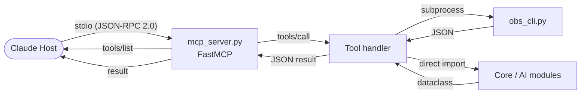

### MCP Tool Groups

#### Vault Tools

| Tool | Args | Returns |
|------|------|---------|
| `list_vaults()` | — | `[{id, name, path, note_count, ...}]` |
| `get_vault_stats(vault_id)` | `vault_id: str` | `{notes, links, tags, density, clusters, ...}` |
| `rescan_vault(vault_id)` | `vault_id: str` | `{notes_scanned, links_found, duration_s}` |

#### Search Tools

| Tool | Args | Returns |
|------|------|---------|
| `search_notes(query, vault_id?, limit?)` | `query: str`; optional `vault_id`, `limit` (default 10) | `[{id, title, snippet, score}]` |
| `list_notes(vault_id, limit?)` | `vault_id: str`; optional `limit` | `[{id, title, path, word_count, tags}]` |

#### Graph Tools

| Tool | Args | Returns |
|------|------|---------|
| `get_hub_notes(vault_id, limit?)` | `vault_id: str`; optional `limit` (default 10) | `[{id, title, pagerank, degree}]` |
| `get_orphaned_notes(vault_id, limit?)` | `vault_id: str`; optional `limit` | `[{id, title, word_count, modified_at}]` |
| `analyze_vault(vault_id)` | `vault_id: str` | `{density, avg_degree, clusters, diameter, hub_notes, ...}` |
| `find_similar_notes(note_id, limit?)` | `note_id: str`; optional `limit` | `[{id, title, similarity_score}]` |

#### Health Tool

| Tool | Args | Returns |
|------|------|---------|
| `get_vault_health(vault_id)` | `vault_id: str` | `{overall, connectivity, link_integrity, structure, freshness, issues: [...]}` |

#### Note CRUD Tools

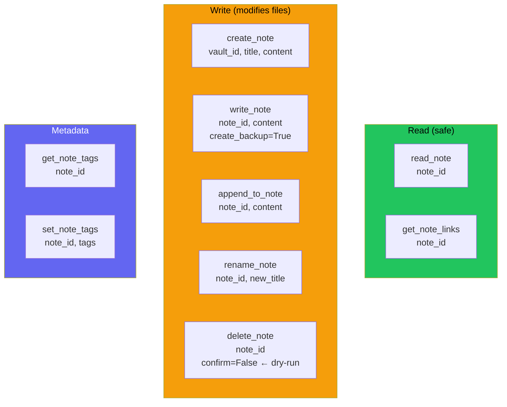

| Tool | Default Safety | Effect |
|------|---------------|--------|
| `read_note(note_id)` | — (read-only) | Returns full note content + frontmatter |
| `get_note_links(note_id)` | — (read-only) | Returns `{incoming: [...], outgoing: [...]}` |
| `get_note_tags(note_id)` | — (read-only) | Returns `[tag1, tag2, ...]` |
| `create_note(vault_id, title, content?)` | — | Creates new `.md` file |
| `write_note(note_id, content, create_backup?)` | `create_backup=True` | Overwrites; auto-creates `.bak` |
| `append_to_note(note_id, content)` | — | Appends to end of file |
| `rename_note(note_id, new_title)` | — | Renames file; warns on broken backlinks |
| `delete_note(note_id, confirm?)` | `confirm=False` (dry-run) | Requires `confirm=True` to actually delete |
| `set_note_tags(note_id, tags)` | — | Updates YAML frontmatter tags |

#### AI Passthrough Tool

| Tool | Args | Returns |
|------|------|---------|
| `run_obs_ai(command, target, options?)` | `command: str` (e.g. `"gaps"`, `"quality"`); `target: str`; optional `options: dict` | Command-specific JSON (see below) |

Valid `command` values:

| command | target | Returns |
|---------|--------|---------|
| `"gaps"` | vault_id | `{gaps: [{topic, references, suggested_title}]}` |
| `"quality"` | vault_id or note_id | `{notes: [{title, overall_score, completeness, connectivity, metadata, freshness}]}` |
| `"merge-suggest"` | vault_id | `[{note_a_id, note_b_id, similarity, shared_links, shared_tags}]` |
| `"tag-suggest"` | vault_id or note_id | `{suggestions: [{note_id, tags: [{tag, confidence}]}]}` |
| `"refactor"` | vault_id | `{suggestions: [{category, priority, description, affected_paths}]}` |
| `"summarize"` | vault_id | `{themes: [...], key_notes: [...], summary: "..."}` |

### MCP Resources

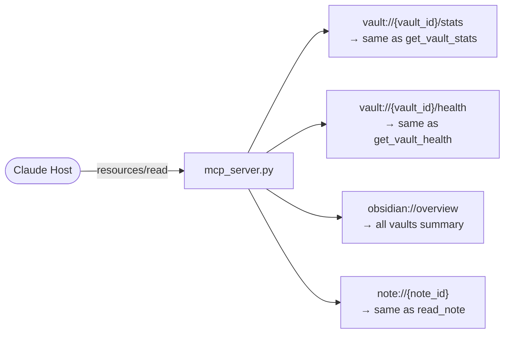

Resources are read-only and do not modify vault state.

---

## Python CLI API (`obs_cli.py`)

The Python CLI is the canonical interface between the presentation layers and the core. All MCP tools ultimately invoke it via subprocess or direct import.

### Invocation Pattern

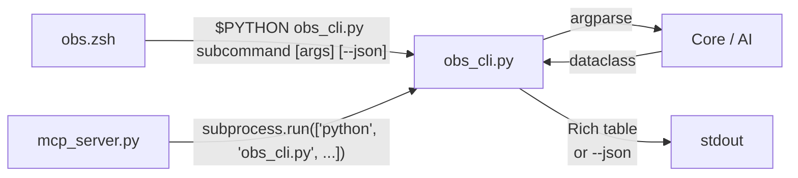

### Subcommand Map

```mermaid
flowchart TD
    P[obs_cli.py] --> V[vault subcommands]
    P --> G[graph subcommands]
    P --> A[ai subcommands]
    P --> DB[db subcommands]

    V --> V1[list-vaults]
    V --> V2[scan PATH]
    V --> V3[discover PATH --scan]
    V --> V4[stats --vault NAME]
    V --> V5[health VAULT]
    V --> V6[analyze VAULT]

    G --> G1[hubs VAULT]
    G --> G2[orphans VAULT]

    A --> A1[ai status / setup / test]
    A --> A2[ai similar NOTE_ID]
    A --> A3[ai analyze NOTE_ID]
    A --> A4[ai duplicates VAULT]
    A --> A5[ai suggest-links NOTE_ID]
    A --> A6[ai gaps VAULT]
    A --> A7[ai summarize VAULT]
    A --> A8[ai refactor VAULT]
    A --> A9[ai merge-suggest VAULT]
    A --> A10[ai tag-suggest TARGET]
    A --> A11[ai quality TARGET]

    DB --> DB1[db init]
```

### `--json` Flag

All data commands accept `--json` for machine-readable output (used by MCP tools and scripting):

```python
# obs_cli.py pattern
if args.json:
    print(json.dumps(result.to_dict(), indent=2))
else:
    console.print(rich_table)
```

---

## Core Python API

### VaultManager

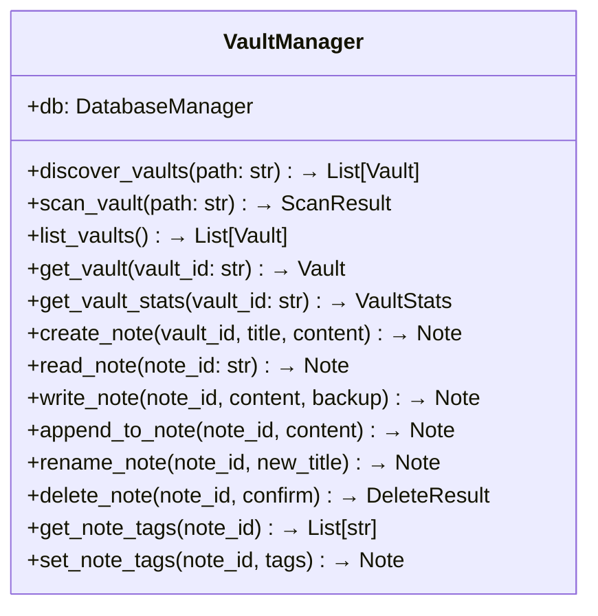

### GraphAnalyzer

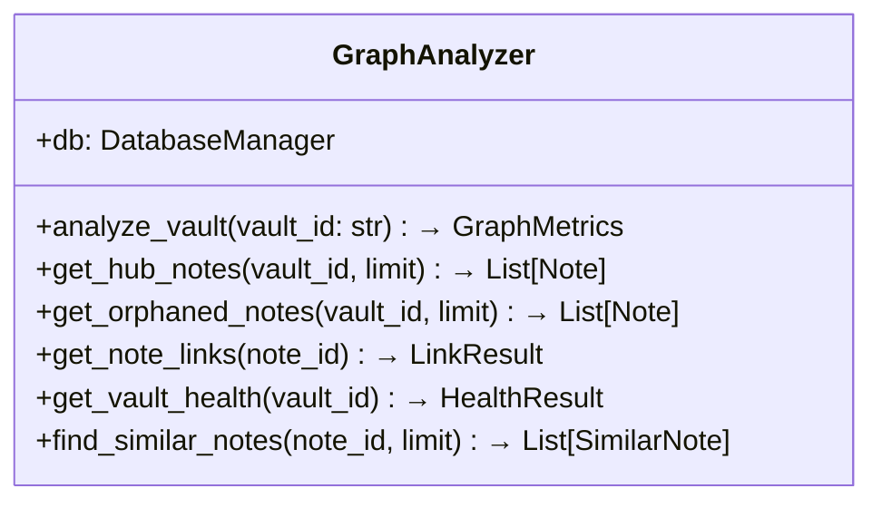

---

## AI Provider Interface

```mermaid
flowchart TD
    AR[AIRouter] -->|"provider_priority list"| P1[GeminiAPIProvider]
    AR --> P2[AnthropicAPIProvider]
    AR --> P3[OllamaProvider]
    AR --> P4[GeminiCLIProvider]
    AR --> P5[ClaudeCLIProvider]

    subgraph Interface["AIProvider interface"]
        IA[is_available() → bool]
        CT[complete(prompt: str) → str]
        EM[embed(text: str) → List[float]]
    end

    P1 -.implements.-> Interface
    P2 -.implements.-> Interface
    P3 -.implements.-> Interface
    P4 -.implements.-> Interface
    P5 -.implements.-> Interface
```

**Fallback logic:**

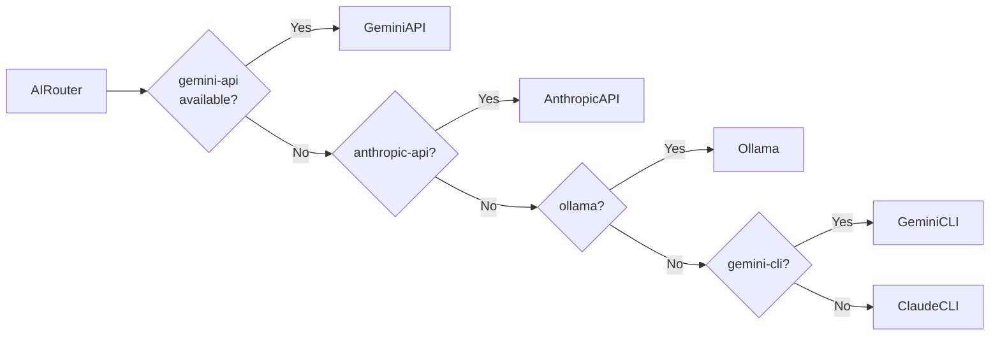

---

## Domain Models

### Core Models

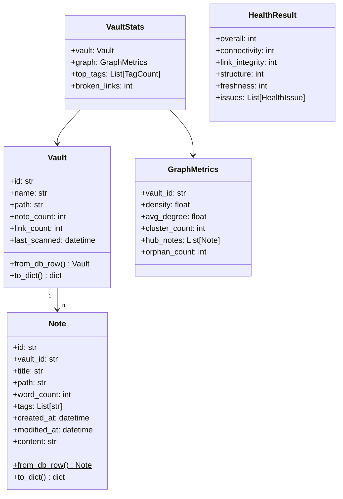

### AI Models

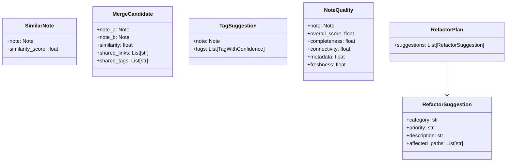

---

## Database Schema

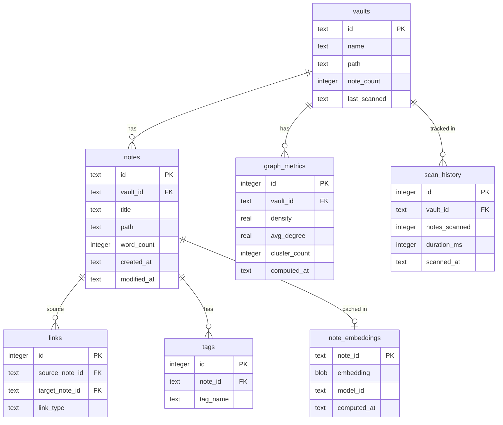

---

## Error Handling

All public API methods raise typed exceptions from `src/python/core/exceptions.py`:

| Exception | When Raised |
|-----------|-------------|
| `VaultNotFoundError` | `vault_id` not registered in database |
| `NoteNotFoundError` | `note_id` not found in database |
| `VaultScanError` | Filesystem errors during scanning |
| `AIProviderError` | All AI providers unavailable |
| `DatabaseError` | SQLite operation failure |

MCP tools catch all exceptions and return structured error JSON rather than propagating to the stdio transport.

---

## See Also

- [Architecture](architecture.md) — layer diagrams and data flows
- [Claude Integration](../claude-integration.md) — MCP setup guide with all 39 tools
- [Testing Overview](testing/overview.md) — test strategy and coverage
