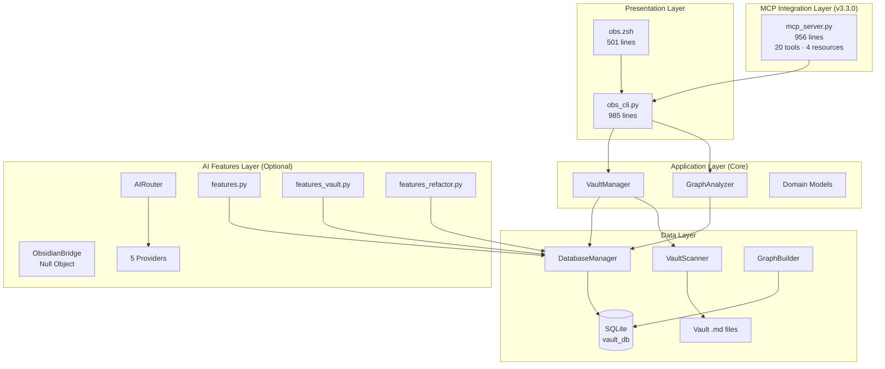
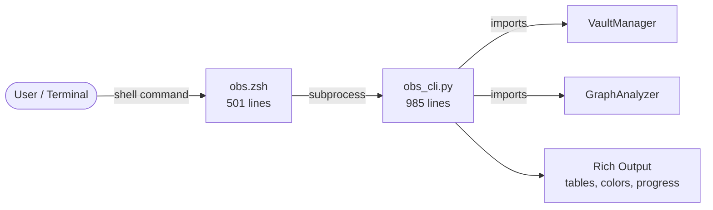
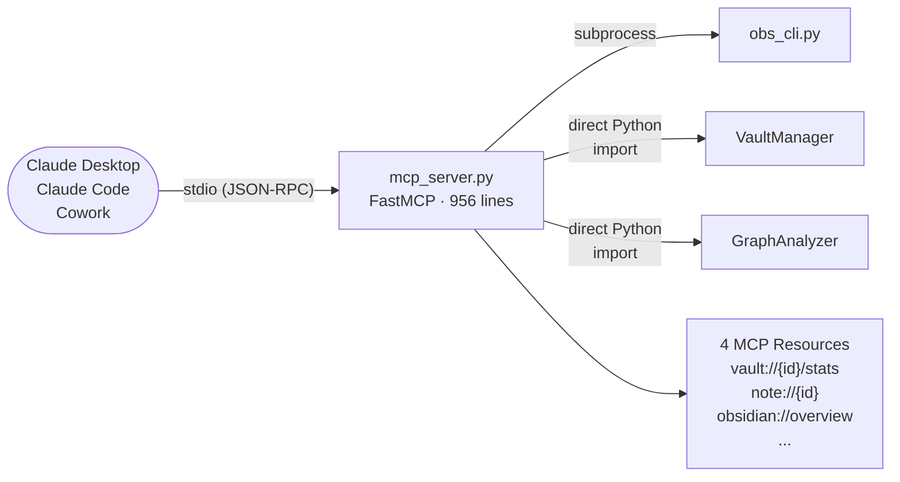
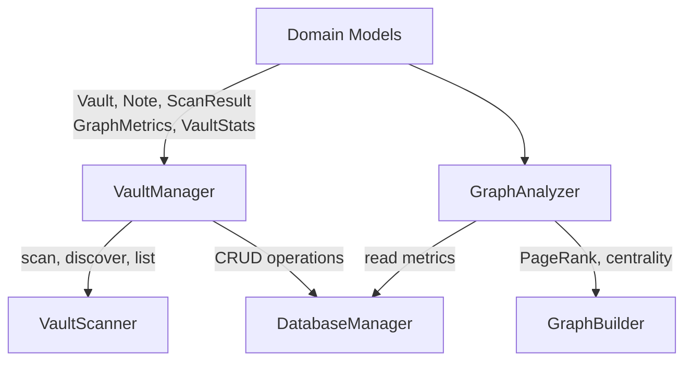
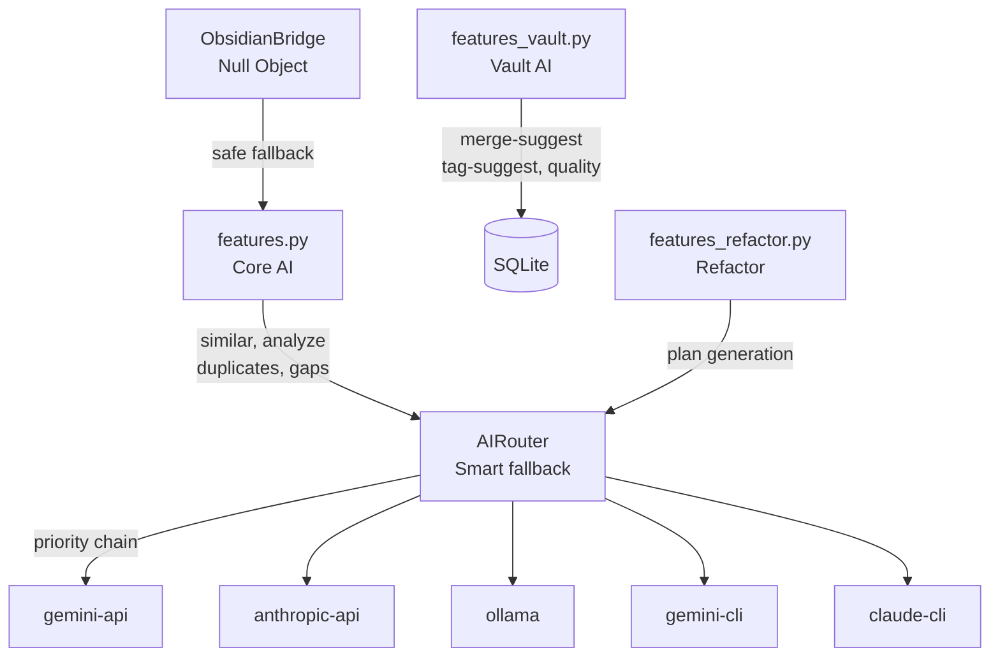
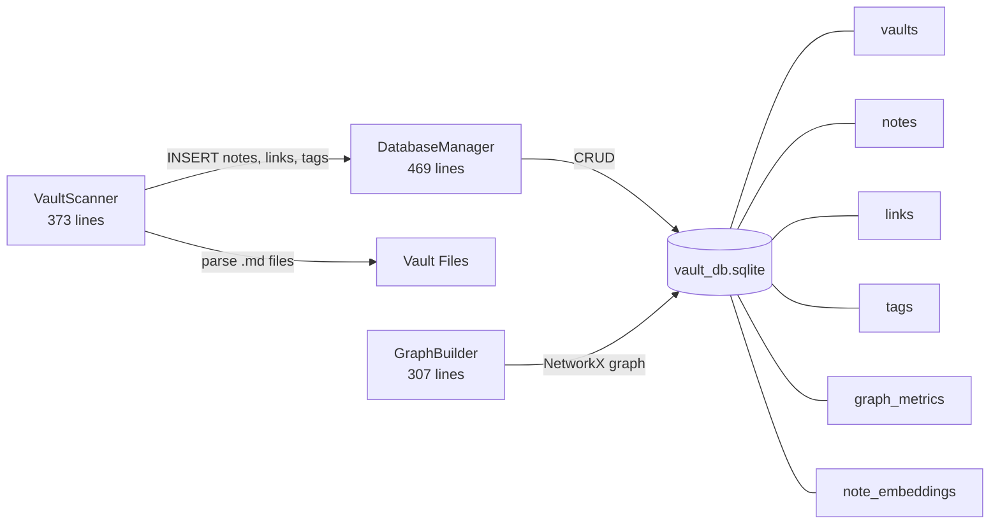
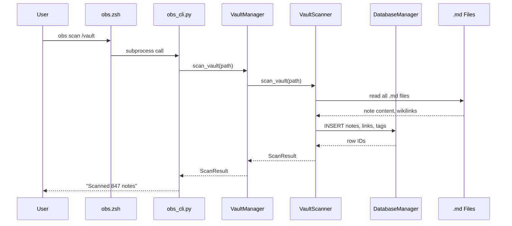
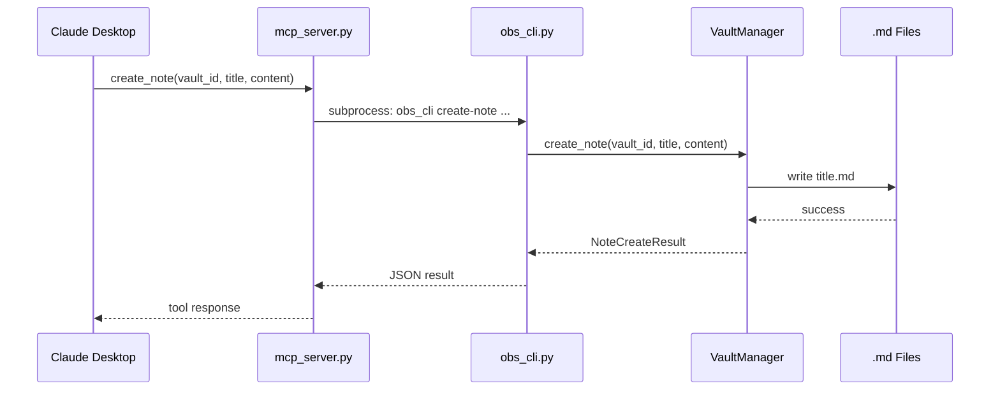
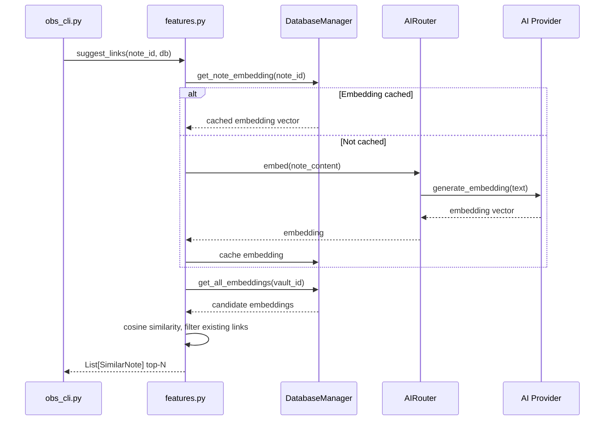

# Architecture

**Version:** 3.4.1

Obsidian CLI Ops follows a clean **four-layer architecture**: Presentation, Application (Core), AI Features, and Data — plus an MCP Integration layer added in v3.3.0.

---

## High-Level Overview



**Key principle:** Business logic lives in the Core layer only. Both the ZSH CLI and the MCP server are thin presentation layers that call `obs_cli.py` subprocesses or Python APIs.

---

## Layer Details

### Presentation Layer



- **`obs.zsh`** — ZSH dispatcher. Resolves Python interpreter (3-candidate chain: `$OBS_PYTHON` → user venv → Homebrew venv → ambient), calls `obs_cli.py` via subprocess, handles `--verbose`.
- **`obs_cli.py`** — Python CLI. Argparse subcommands, calls Core/AI methods, formats output with Rich.

### MCP Integration Layer (v3.3.0)



- **20 MCP tools** in 6 groups: Vault (3), Search (2), Graph (4), Health (1), Notes (9), AI (1)
- **FastMCP** (`from mcp.server.fastmcp import FastMCP`) — stdio transport, clean exit when no client
- Note write tools include built-in safety: `delete_note` defaults `confirm=False` (dry-run), `write_note` defaults `create_backup=True`

### Application Layer (Core)



- **VaultManager** — vault discovery, scanning, database registration, stats
- **GraphAnalyzer** — graph metrics, hub detection, orphan detection, clustering
- **Domain Models** — typed dataclasses with `from_dict()`, `to_dict()`, `from_json()`

### AI Features Layer



- All providers implement a common `AIProvider` interface and return identical dataclass types
- Embedding cache in `note_embeddings` SQLite table with mtime invalidation
- **ObsidianBridge** uses Null Object pattern: returns empty results when Obsidian CLI is unavailable (never crashes)

### Data Layer



---

## Key Data Flows

### Vault Scan



### MCP Tool Call (note creation via Claude)



### AI Suggest-Links



---

## Design Patterns

| Pattern | Where Used |
|---------|-----------|
| **Repository** | `DatabaseManager` wraps all SQLite operations |
| **Facade** | `VaultManager` / `GraphAnalyzer` simplify complex multi-step operations |
| **Factory** | `from_db_row()` class methods on every domain model |
| **Dependency Injection** | Core classes accept an optional `DatabaseManager` |
| **Null Object** | `ObsidianBridge` returns empty results when Obsidian CLI unavailable |
| **Strategy** | `AIRouter` selects among 5 interchangeable provider strategies |
| **Adapter** | Each AI provider adapts a different API to the common `AIProvider` interface |

---

## File Structure

```
src/python/
  core/                      # APPLICATION LAYER
    vault_manager.py         # Vault operations (~400 lines)
    graph_analyzer.py        # Graph operations (~350 lines)
    models.py                # Domain models (~310 lines)
    exceptions.py            # Custom exceptions

  ai/                        # AI FEATURES LAYER
    features.py              # Core AI: similar, analyze, duplicates, suggest-links, gaps, summarize
    features_vault.py        # Vault AI: merge-suggest, tag-suggest, quality (v3.2.0)
    features_refactor.py     # Refactor pipeline (extracted v3.2.0)
    router.py                # Smart provider selection + fallback chain
    models.py                # AI dataclasses: AnalysisResult, SimilarNote, MergeCandidate, TagSuggestion, NoteQuality...
    obsidian_bridge.py       # Null Object bridge to Obsidian CLI
    providers/               # 5 provider implementations

  mcp_server.py              # MCP INTEGRATION LAYER (v3.3.0, 956 lines)
  obs_cli.py                 # PRESENTATION LAYER (985 lines)
  db_manager.py              # DATA LAYER: SQLite CRUD
  vault_scanner.py           # DATA LAYER: .md file parsing
  graph_builder.py           # DATA LAYER: NetworkX graph construction

src/obs.zsh                  # PRESENTATION LAYER: ZSH dispatcher (501 lines)
schema/vault_db.sql          # Database schema
```

---

## Testing

- **304 pytest tests** covering core, AI, vault features, data layer, and MCP server
- **69 Jest tests** for ZSH wrapper + dependency-bootstrapping validation
- Core layer tested independently with mocked dependencies
- AI providers mocked for deterministic tests
- MCP tools tested via FastMCP test client

See [Testing Overview](testing/overview.md) for full details.
