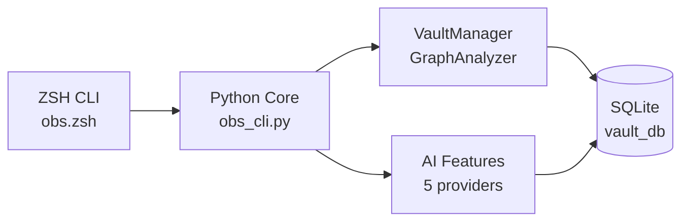

# obs -- Your Vault's Command Line

[](https://github.com/Data-Wise/obsidian-cli-ops/releases)
[](https://github.com/Data-Wise/obsidian-cli-ops/actions)
[](https://github.com/Data-Wise/obsidian-cli-ops)
[](https://www.python.org/)
[](https://github.com/Data-Wise/obsidian-cli-ops/blob/main/LICENSE)

A laser-focused CLI for Obsidian vault management with AI-powered graph analysis.

[Install Now](installation.md){ .md-button .md-button--primary }
[Quick Reference](refcard.md){ .md-button }

---

## What It Does

!!! tip "Vault Discovery"
    Automatically find and scan Obsidian vaults. Tracks notes, links, tags, and graph structure in a local SQLite database.

!!! tip "AI Insights"
    Find similar notes, detect duplicates, identify knowledge gaps, and get reorganization suggestions -- powered by 5 AI providers with smart fallback routing.

!!! tip "Graph Analysis"
    PageRank, centrality, clustering, orphan/hub detection. Understand your vault's structure at a glance with the health dashboard.

---

## Quick Start

```bash
# 1. Install
brew install data-wise/tap/obsidian-cli-ops

# 2. Discover your vaults
obs discover ~/Documents --scan

# 3. Check vault health
obs health MyVault
```

---

## Architecture



**Three-layer design:** Presentation (CLI) --> Application (Core + AI) --> Data (SQLite + Files)

---

## Learn More

- [Installation](installation.md) -- Homebrew or manual setup
- [Usage](usage.md) -- Core commands and workflows
- [Quick Reference](refcard.md) -- Command cheat sheet
- [Cookbook](cookbook.md) -- Task-based recipes
- [AI Setup Guide](ai-setup.md) -- Configure AI providers
- [Architecture](developer/architecture.md) -- How it works
