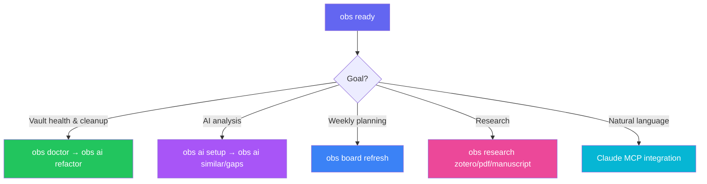
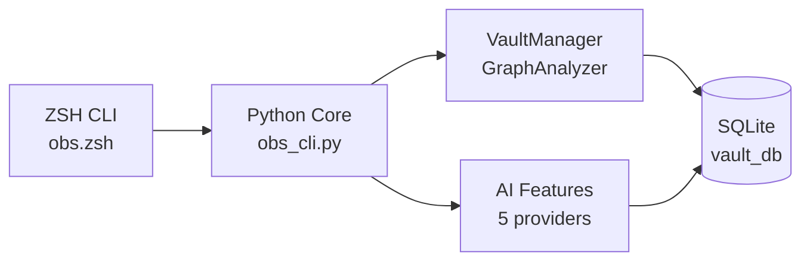

# obs -- Your Vault's Command Line

[](https://github.com/Data-Wise/obsidian-cli-ops/releases)
[](https://github.com/Data-Wise/obsidian-cli-ops/actions)
[](https://github.com/Data-Wise/obsidian-cli-ops)
[](https://www.python.org/)
[](claude-integration.md)
[](https://github.com/Data-Wise/obsidian-cli-ops/blob/main/LICENSE)

A laser-focused CLI for Obsidian vault management with AI-powered graph analysis — and a full
Claude / MCP integration so you can query your vaults in natural language.

[Install Now](installation.md){ .md-button .md-button--primary }
[:material/book-open-page-variant: Quick Reference](refcard.md){ .md-button }
[Claude Integration](claude-integration.md){ .md-button }

---

## What It Does

!!! tip "Vault Discovery"
    Automatically find and scan Obsidian vaults. Tracks notes, links, tags, and graph structure in a local SQLite database.

!!! tip "AI Insights"
    Find similar notes, detect duplicates, identify knowledge gaps, and get reorganization suggestions -- powered by 5 AI providers with smart fallback routing.

!!! tip "Graph Analysis"
    PageRank, centrality, clustering, orphan/hub detection. Understand your vault's structure at a glance with the health dashboard.

!!! tip "Board Sync (v4.3.0)"
    `obs board refresh` generates a deterministic `_ACTION-BOARD.md` from atlas
    state, vault stats, and `.STATUS` files — heuristic-ranked action items plus
    status tables. LLM augments thinking sections on demand.

!!! tip "Claude Integration (v4.0.0)"
    42 MCP tools connect `obs` to Claude Desktop, Claude Code, and Cowork. Ask Claude to search, analyze, create, and edit your vault notes in plain English. [Setup takes 5 minutes →](claude-integration.md)

!!! tip "Diagnostics & Doctor"
    `obs doctor` runs self-checks across 7 layers (runtime, DB, vault, sync, MCP, docs, iCloud) plus `flow`. Clear ghost notes with `obs scan --prune`. [Diagnostics tutorial →](tutorials/doctor.md)

!!! tip "Vault↔Repo Mirroring (v4.3.1)"
    `obs flow init` writes `.flow/obsidian-sync.yml` — the single vault↔repo mirror map for savant planning. [Mirroring tutorial →](tutorials/flow-init.md)

---

## Quick Start

### 1. Install & scan

```bash
brew install data-wise/tap/obsidian-cli-ops
obs discover ~/Documents --scan
obs health MyVault
```

### 2. Pick your workflow



---

## Architecture



**Three-layer design:** Presentation (CLI) --> Application (Core + AI) --> Data (SQLite + Files)

---

## Learn More

- [Installation](installation.md) -- Homebrew or manual setup
- [Usage](usage.md) -- Core commands and workflows
- [Quick Reference](refcard.md) -- Command cheat sheet
- [Cookbook](cookbook.md) -- Task-based recipes
- [AI Setup Guide](ai-setup.md) -- Configure AI providers
- [Claude Integration](claude-integration.md) -- MCP server setup (42 tools)
- [Architecture](developer/architecture.md) -- How it works
