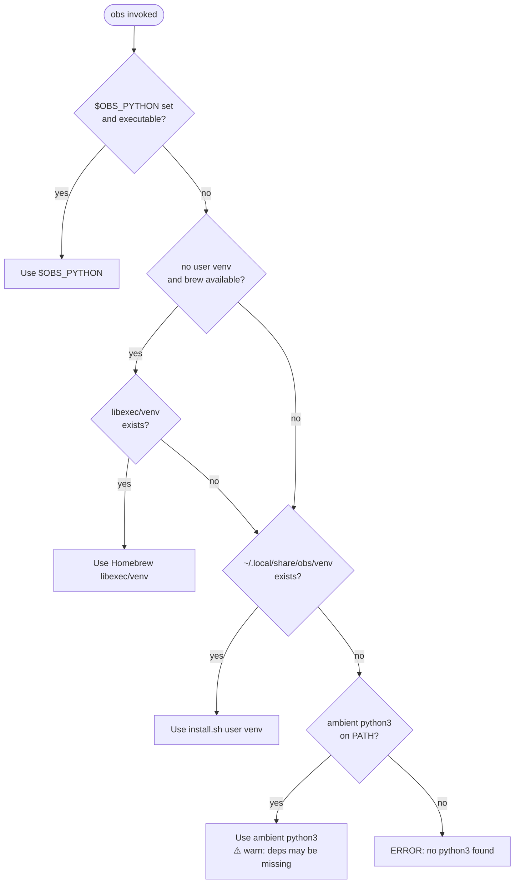

# Installation

> **TL;DR** (30 seconds)
> - **What:** Install `obs` via Homebrew or manual setup
> - **Why:** Manage Obsidian vaults from the terminal in seconds
> - **How:** `brew install data-wise/tap/obsidian-cli-ops`
> - **Next:** [Configuration](configuration.md) for optional settings
{ .tldr }

---

## :beer: Homebrew (Recommended)

```bash
brew install data-wise/tap/obsidian-cli-ops
```

This installs `obs` with all Python dependencies in an **isolated virtual environment** (`libexec/venv`) and sets up the shell integration automatically. No manual `pip` step is ever needed, and a system Python upgrade won't break `obs`.

## :hammer_and_wrench: Manual Install

### Prerequisites

- **macOS** or **Linux**
- **Python 3.9+**: `python3 --version`
- **ZSH**: Default on macOS; available on Linux via `apt install zsh`
- **Git**: For cloning the repository

### Steps

1. **Clone the repository**:

    ```bash
    git clone https://github.com/Data-Wise/obsidian-cli-ops.git ~/projects/obsidian-cli-ops
    cd ~/projects/obsidian-cli-ops
    ```

2. **Run the installer** (symlinks the CLI **and** provisions deps):

    ```bash
    ./install.sh
    ```

    This creates an isolated virtual environment at `~/.local/share/obs/venv`,
    installs the pinned dependencies from `requirements.lock`, and symlinks the
    `obs.zsh` launcher into `~/.config/zsh/functions`. It is **idempotent** — it
    only re-provisions when `requirements.lock` changes. No manual `pip` needed.

    !!! note "Why not `pip install`?"
        Installing into your system/ambient Python is fragile: a `python@3.x`
        minor upgrade silently drops the packages and `obs` breaks with
        `ModuleNotFoundError`. The isolated venv avoids this entirely.

3. **Enable shell autoload** — add to your `~/.zshrc`:

    ```zsh
    fpath=(~/.config/zsh/functions $fpath)
    autoload -Uz obs
    ```

4. **Initialize the database**:

    ```bash
    python3 src/python/obs_cli.py db init
    ```

5. **Restart your shell**:

    ```bash
    source ~/.zshrc
    ```

## :package: How dependencies are provisioned

`obs` runs its bundled Python code against an interpreter that **must** have the
core dependencies (`rich`, `networkx`, `click`, `python-frontmatter`, `PyYAML`,
`requests`). Both install paths put those deps in a **dedicated, isolated
environment** — never your system Python:

| Install path | Environment | Source of pins |
|---|---|---|
| Homebrew | `libexec/venv` (formula-owned) | formula `resource` blocks |
| `install.sh` | `~/.local/share/obs/venv` | `requirements.lock` |

Each run, the launcher resolves `OBS_PYTHON` in priority order. It **never**
silently trusts a bare `python3` (that was the source of the historical
`ModuleNotFoundError: 'rich'` crash):



You can always force a specific interpreter by exporting `OBS_PYTHON` (tier 1),
which takes precedence over everything else.

## :white_check_mark: Verify Installation

```bash
# Check version
obs version

# List discovered vaults
obs
```

You should see the version number and any Obsidian vaults found in your iCloud directory.

## :sos: Troubleshooting

### `ModuleNotFoundError` (e.g. `No module named 'rich'`)

This means `obs` resolved to a Python **without** its deps — usually because no
isolated environment exists yet. If you also see a `[obs] WARN: ... ambient
python3 ... dependencies may be missing` line, that's the launcher telling you
it fell through to tier 4. Provision an isolated env:

```bash
brew reinstall obsidian-cli-ops   # Homebrew
# or, for a manual checkout:
./install.sh
```

After a `python@3.x` upgrade via Homebrew, `obs` keeps working because its deps
live in `libexec/venv`, not in the upgraded interpreter.

### Python not found

If `obs` reports a Python error, ensure `/opt/homebrew/bin/python3` (macOS) or `/usr/bin/python3` (Linux) exists. You can set a custom path:

```bash
export OBS_PYTHON=/path/to/python3
```

### ZSH autoload not working

Verify the function file is in your `fpath`:

```bash
echo $fpath | tr ' ' '\n' | grep obs
```

If nothing appears, double-check the symlink path and your `~/.zshrc` configuration.

### Database initialization fails

Ensure the config directory exists:

```bash
mkdir -p ~/.config/obs
python3 src/python/obs_cli.py db init
```

---

## Next Steps

- [Configuration](configuration.md) -- AI providers, shell integration, advanced settings
- [Usage](usage.md) -- Core commands and workflows
