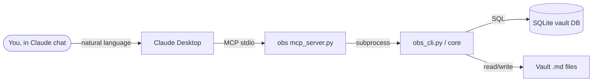

# Claude / MCP Integration Tutorial

Connect `obs` to Claude Desktop and use natural language to search, analyze, and edit your Obsidian vaults.

**Time:** ~20 minutes | **Level:** 🟣 Integration | **Steps:** 10

**Prerequisites:** Complete [Getting Started](getting-started.md) and have Claude Desktop installed.

---

## Step 1: What Is the MCP Integration?

MCP (Model Context Protocol) lets Claude Desktop call tools in external programs. `obs` ships an MCP server (`mcp_server.py`) that exposes **40 tools** covering your full vault workflow:



**What becomes possible:**

- *"Search my research vault for causal inference"* → `search_notes()`
- *"Create a note called 'Meeting 2026-06-15'"* → `create_note()`
- *"What are my most orphaned notes?"* → `get_orphaned_notes()`
- *"Run a quality check on MyVault"* → `run_obs_ai("quality", "MyVault")`

---

## Step 2: Install `obs` via Homebrew

If not already installed:

```bash
brew install data-wise/tap/obsidian-cli-ops
obs version   # should print 3.3.0
```

The Homebrew formula includes `mcp==1.27.2` and all transitive deps in an isolated
venv at `/opt/homebrew/opt/obsidian-cli-ops/libexec/venv/`.

---

## Step 3: Register Your Vaults

Claude's MCP tools query the obs database. Make sure your vaults are registered:

```bash
obs discover ~/Documents --scan
obs   # verify vaults appear
```

Expected output:

```
┌──────────────────────────────────────────────────────┐
│  Vault           Notes   Links   Last Scanned        │
├──────────────────────────────────────────────────────┤
│  Research        847     2,341   2 minutes ago       │
│  Work            234     891     5 minutes ago       │
└──────────────────────────────────────────────────────┘
```

If you add new notes later, rescan with `obs analyze MyVault` or ask Claude: *"Rescan MyVault"*.

---

## Step 4: Add the MCP Server to Claude Desktop

Open (or create) this file:

```
~/Library/Application Support/Claude/claude_desktop_config.json
```

Add the `obsidian-ops` entry inside `"mcpServers"`:

```json
{
  "mcpServers": {
    "obsidian-ops": {
      "command": "/bin/zsh",
      "args": [
        "-c",
        "OBS_PYTHON=\"${OBS_PYTHON:-}\"; if [ -z \"$OBS_PYTHON\" ]; then for c in \"$HOME/.local/share/obs/venv/bin/python3\" \"/opt/homebrew/opt/obsidian-cli-ops/libexec/venv/bin/python3\"; do [ -x \"$c\" ] && OBS_PYTHON=\"$c\" && break; done; fi; exec \"${OBS_PYTHON:-python3}\" /Users/YOUR_USERNAME/projects/dev-tools/obsidian-cli-ops/src/python/mcp_server.py"
      ],
      "env": {}
    }
  }
}
```

Replace `YOUR_USERNAME` with your macOS username (`whoami` in Terminal).

!!! warning "JSON is strict"
    No trailing commas. Validate with:
    ```bash
    python3 -m json.tool ~/Library/"Application Support"/Claude/claude_desktop_config.json
    ```

---

## Step 5: Restart Claude Desktop and Verify

`Cmd+Q` → reopen Claude Desktop. The `obsidian-ops` connector should appear in the tool panel.

Test it by typing:

> *"List my Obsidian vaults"*

Claude should call `list_vaults()` and return your vault list. If it doesn't, see
[Troubleshooting](../claude-integration.md#troubleshooting).

---

## Step 6: Search and Explore (Read-Only Tools)

Try these prompts — they only read data, nothing is modified:

**Vault overview:**
> *"Show me stats for my Research vault"*

```
Claude calls: get_vault_stats("Research")
Returns: 847 notes, 2,341 links, density 0.023, 12 clusters
```

**Search:**
> *"Search my Research vault for causal mediation, show the top 5"*

```
Claude calls: search_notes("causal mediation", vault_id="Research", limit=5)
Returns: ranked list of matching notes with titles and snippets
```

> **Tip:** You can also search natively from your terminal: `obs search "causal mediation"`

**Graph analysis:**
> *"What are the 10 most connected notes in Research?"*

```
Claude calls: get_hub_notes("Research", limit=10)
Returns: hub notes ranked by PageRank with connection counts
```

**Orphan detection:**
> *"List orphaned notes in Research that I should link up"*

```
Claude calls: get_orphaned_notes("Research", limit=20)
Returns: list of isolated notes with word counts and last modified dates
```

**Health check:**
> *"Run a health check on Research and give me a priority fix list"*

```
Claude calls: get_vault_health("Research")
Returns: 4-dimension scores + Claude's prioritized recommendations
```

---

## Step 7: Read and Navigate Notes

**Read a specific note:**
> *"Read the note about collider bias in my Research vault"*

```
Claude calls: search_notes("collider bias", vault_id="Research", limit=1)
             then: read_note(note_id)
Returns: full note content including YAML frontmatter
```

**Find related notes:**
> *"Find notes similar to my collider-bias note"*

```
Claude calls: find_similar_notes(note_id, limit=10)
Returns: semantically similar notes with similarity scores
```

**Inspect links:**
> *"What notes link to collider-bias? What does it link to?"*

```
Claude calls: get_note_links(note_id)
Returns: incoming links (backlinks) and outgoing links
```

---

## Step 8: Create and Edit Notes

!!! warning "These tools modify your vault files"
    Claude will describe the action before calling write tools. Review before confirming.

**Create a new note:**
> *"Create a note in Research called 'Sensitivity Analysis 2026-06-15' with these sections: Overview, Methods, Results, References"*

```
Claude calls: create_note(
    vault_id="Research",
    title="Sensitivity Analysis 2026-06-15",
    content="# Sensitivity Analysis 2026-06-15\n\n## Overview\n\n## Methods\n..."
)
```

**Append to an existing note:**
> *"Append these key points from today's meeting to my collider-bias note: [...]"*

```
Claude calls: append_to_note(note_id, content="---\n## Meeting Notes 2026-06-15\n[...]")
```

**Edit a note:**
> *"Rewrite the abstract section of my collider-bias note to be more concise: [...]"*

```
Claude calls: read_note(note_id)          # get current content
             then: write_note(note_id, new_content, create_backup=True)
             # .bak backup is created automatically
```

**Insert content at a heading (surgical edit):**
> *"Add a new result to the 'Results' table in my sensitivity-analysis note: | Method B | 0.82 | 0.03 |"*

```
Claude calls: insert_to_note(
    note_id,
    content="| Method B | 0.82 | 0.03 |",
    after_heading="Results",
    as_table_row=True
)
# Appends the row to the existing Markdown table without touching the rest of the note
```

> *"Insert a 'Limitations' section just before the 'References' heading in my collider-bias note"*

```
Claude calls: insert_to_note(
    note_id,
    content="## Limitations\n\nTo be filled in.",
    before_heading="References"
)
```

> *"Replace the 'Abstract' section of my paper note with this new text: [...]"*

```
Claude calls: insert_to_note(
    note_id,
    content="This paper examines...",
    replace_section="Abstract"
)
# Replaces everything between '## Abstract' and the next same-level heading
```

!!! tip "insert_to_note vs write_note vs append_to_note"
    - **`append_to_note`** — adds to end of file, no structure awareness
    - **`write_note`** — full replacement (always creates `.bak` backup first)
    - **`insert_to_note`** — surgical heading-aware edit; leaves the rest of the note intact

**Rename a note:**
> *"Rename 'collider-bias' to 'Collider Bias - Regression Discontinuity'"*

```
Claude calls: rename_note(note_id, "Collider Bias - Regression Discontinuity")
Returns: warning if other notes link to the old name (wikilinks will break)
```

**Delete a note (dry-run first):**
> *"Delete the note 'scratch-pad-old'"*

```
Claude calls: delete_note(note_id, confirm=False)   # dry-run by default
Returns: "Would delete: scratch-pad-old.md (234 words, 0 incoming links)"
Claude asks: "Confirm deletion?"
You: "Yes"
Claude calls: delete_note(note_id, confirm=True)
```

---

## Step 9: AI Features via MCP

The `run_obs_ai` tool bridges all `obs ai` subcommands:

**Find knowledge gaps:**
> *"What topics are missing from my Research vault?"*

```
Claude calls: run_obs_ai("gaps", "Research")
Returns: stub notes, orphaned topics, suggested new notes
```

**Quality scoring:**
> *"Score all notes in Research and show me the 5 worst"*

```
Claude calls: run_obs_ai("quality", "Research")
Returns: notes ranked by weighted score (completeness/connectivity/metadata/freshness)
```

**Merge candidates:**
> *"Find notes in Research that overlap so much they might be merged"*

```
Claude calls: run_obs_ai("merge-suggest", "Research")
Returns: note pairs with cosine similarity > 0.8, shared links/tags
```

**Tag suggestions:**
> *"Suggest tags for all untagged notes in Research"*

```
Claude calls: run_obs_ai("tag-suggest", "Research")
Returns: tag suggestions per note with confidence scores
```

**Vault reorganization:**
> *"Give me a reorganization plan for Research"*

```
Claude calls: run_obs_ai("refactor", "Research")
Returns: categorized suggestions: move, archive, merge-folder, connect, create-folder
```

---

## Step 10: Advanced Patterns

### Chain tools for a research workflow

> *"I'm starting a new paper on sensitivity analysis. Search for related notes, find gaps, then create a project outline note linking the most relevant ones."*

Claude chains: `search_notes` → `get_vault_health` → `run_obs_ai("gaps")` → `create_note`

### Keep vault fresh after editing

After writing notes in Obsidian, rescan so Claude sees the changes:

> *"I just added 10 new notes. Please rescan my Research vault."*

```
Claude calls: rescan_vault("Research")
```

### Export-as-script pattern

Ask Claude to generate a shell script from its analysis:

> *"Based on the orphaned notes you found, generate an obs command I can run to analyze each one"*

```bash
# Claude generates:
for id in note-abc123 note-def456 note-ghi789; do
    obs ai analyze $id
done
```

---

## What's Next

| Goal | Tutorial / Doc |
|------|----------------|
| Full tool reference | [Claude Integration](../claude-integration.md) |
| All 40 MCP tools | [CLI Reference — MCP section](../cli-reference.md#claude-mcp-integration) |
| Cowork plugin (Phase 2) | [Proposal](https://github.com/Data-Wise/obsidian-cli-ops/blob/dev/PROPOSAL-claude-integration-2026-06-15.md) |
| Developer API details | [API Reference](../developer/api-reference.md) |

---

**Summary:** You wired the MCP server into Claude Desktop, searched and explored vaults, read and wrote notes, and ran AI analysis — all from a Claude chat session. The `obsidian-ops` MCP server is now a permanent connector available in every Claude Desktop conversation.
