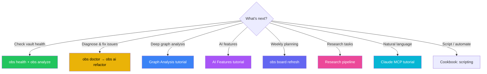

# Getting Started

Get obs installed, scanning your first vault, and running real workflows
in under 15 minutes.

**Time:** ~15 minutes | **Level:** Beginner | **Steps:** 9

---

## Step 1: What is obs?

`obs` (Obsidian CLI Ops) is your vault's command line.
It scans your Obsidian vaults, builds a knowledge graph,
and runs 8 major workflows:

| Workflow | Command | What it does |
|----------|---------|--------------|
| Vault health | `obs health`, `obs doctor` | 4-dimension scoring + diagnostics |
| Graph analysis | `obs analyze` | PageRank, centrality, clusters |
| AI features | `obs ai similar/gaps/refactor` | Semantic search, dupes, refactors |
| Weekly planning | `obs board refresh` | Auto-generates `_ACTION-BOARD.md` |
| Research pipeline | `obs research zotero/pdf/manuscript` | Zotero, PDFs, ms tracking |
| Diagnostics | `obs doctor` | 7-layer health check |
| Claude/MCP | 42 MCP tools | Natural language queries |
| Scripting | `--json` flag | All data commands export JSON |

---

## Step 2: Install Dependencies

### Option A: Homebrew (recommended)

```bash
brew install data-wise/tap/obsidian-cli-ops
```

### Option B: Manual (isolated venv, no manual pip)

```bash
git clone https://github.com/Data-Wise/obsidian-cli-ops.git
cd obsidian-cli-ops
./install.sh
```

??? tip "Already have deps?"
    `./install.sh` is a no-op unless `requirements.lock` changed. Verify:
    `python3 -c "import networkx; import rich"` against the venv.

### Initialize the database

```bash
python3 src/python/obs_cli.py db init
```

**Expected output:**

```text
✅ Database initialized at ~/.config/obs/vault_db.sqlite
```

The database is stored locally in `~/.config/obs/` — no data leaves your machine.

---

## Step 3: Discover & Scan Your Vaults

Discover finds Obsidian vaults (directories with `.obsidian/`).
Scan reads every markdown file, extracts wikilinks, tags,
and metadata, and builds the knowledge graph.

### Discover vaults

```bash
obs discover ~/Documents
obs discover ~/Library/Mobile\ Documents/iCloud~md~obsidian/Documents
```

**Expected output:**

```text
🔍 Searching for Obsidian vaults...

✓ Found 2 vault(s):
  • /Users/you/Documents/MyVault
  • /Users/you/Documents/WorkNotes
```

### Scan in one step

```bash
obs discover ~/Documents --scan
```

### Or scan a vault directly

```bash
obs scan /path/to/your/vault
```

**Expected output:**

```text
📂 Scanning vault: MyVault
  Notes: 142
  Links: 387
  Tags: 56
  ✅ Scan complete
```

!!! tip "Re-scanning"
    Scanning is additive by default — it adds and updates notes but never
    removes rows. Pass `--prune` to sweep notes deleted or renamed on
    disk out of the index. Unchanged notes are skipped via content-hash
    comparison, so AI embeddings survive re-scans.

---

## Step 4: Your First Look — List Vaults & Stats

### List all registered vaults

```bash
obs
```

### View detailed stats

```bash
obs stats --vault MyVault
```

**Expected output:**

```text
📊 MyVault
  Path: /Users/you/Documents/MyVault
  Last Scanned: 2 minutes ago

  Content
    Notes: 142
    Links: 387
    Tags: 56

  Graph Health
    Orphaned: 12
    Hubs (>10 links): 5
    Broken Links: 3
```

### Search notes by title

```bash
obs search "causal mediation"
obs search "meeting" --vault Work --limit 5   # One vault, cap at 5
obs search "causal" --json                    # Machine-readable output
```

`obs search` is a fast graph-database title search — no AI needed.

---

## Step 5: Vault Health & Diagnostics

Once your vault is scanned, run a health check to see how it's doing.

### Health dashboard

```bash
obs health MyVault
```

Scores your vault across 4 dimensions — connectivity, link integrity, structure,
freshness — with recommendations for each.

### Graph analysis

```bash
obs analyze MyVault
obs analyze MyVault --verbose   # Also shows hubs, orphans, broken links
```

Reports PageRank, centrality, clustering coefficient, and graph density.

### Full diagnostic

```bash
obs doctor
obs doctor --layer sync        # Check vault ↔ index drift
obs doctor --layer docs        # Check doc count accuracy
obs doctor --vault MyVault     # Scope to one vault
```

`obs doctor` runs checks across 7 layers: Python runtime, database, vault health,
sync drift, MCP config, doc count accuracy, and iCloud offload detection.

---

## Step 6: Weekly Planning — Board Refresh

The `obs board` command generates a deterministic `_ACTION-BOARD.md` in your vault
from three sources: atlas project state, `.STATUS` files, and vault DB stats.

```bash
# Preview what would change
obs board refresh --dry-run

# Generate the board
obs board refresh

# Check its status
obs board status --vault MyVault
```

**What the board contains:**

| Section | Origin | Editable? |
|---------|--------|-----------|
| Project status tables | Atlas + `.STATUS` + vault | Overwritten on refresh |
| "Act on now" | Heuristic ranking | Overwritten on refresh |
| TL;DR | LLM placeholder | Augment via prompt |
| Future ideas | LLM placeholder | Augment via prompt |
| This week plan | LLM placeholder | Augment via prompt |

After refresh, open `_ACTION-BOARD.md` in your vault. The deterministic tables
are ready immediately; run the `research--action-board` prompt to have the LLM
augment the thinking sections.

!!! tip "Automated refresh"
    The launchd plist `com.data-wise.obs-board-refresh` refreshes every Monday at 09:15.
    Manual: `scripts/board-refresh.sh`

---

## Step 7: AI-Powered Analysis

Unlock semantic search, duplicates detection, knowledge gaps, and reorganization.

### Set up a provider

```bash
obs ai status          # Check what's available
obs ai setup           # Interactive wizard
obs ai test            # Test all configured providers
```

**Pick a provider:**

| Provider | Setup | Speed | Privacy |
|----------|-------|-------|---------|
| `gemini-cli` | Pre-installed | Fast | API call |
| `claude-cli` | Pre-installed | Fast | API call |
| `ollama` | Local install | Medium | **100% local** |
| `gemini-api` | API key | Fast | API call |
| `anthropic-api` | API key | Fast | API call |

### Run analysis

```bash
obs ai similar <note_id>          # Find semantically similar notes
obs ai duplicates MyVault         # Detect duplicate content
obs ai gaps MyVault               # Find knowledge gaps (stubs, orphans)
obs ai summarize MyVault          # Vault-wide themes
obs ai quality MyVault            # Score notes across 4 dimensions
obs ai merge-suggest MyVault      # Find merge candidates
obs ai tag-suggest MyVault        # Suggest tags for untagged notes
obs ai refactor MyVault           # Reorganization plan
```

!!! warning "AI is read-only"
    All AI commands only **suggest** — they never move, delete, or modify your files.
    Safe to run anytime.

---

## Step 8: Research Pipeline

Combine Zotero, PDF search, and manuscript tracking — all from the terminal.

**Prerequisites:** [Research Setup](research-setup.md)

```bash
obs research zotero search "causal mediation" --limit 10
obs research zotero get A1B2C3D4                    # Get by Zotero key
obs research zotero recent --limit 5                # Recently modified

obs research pdf search "instrumental variable"      # Full-text PDF search

obs research manuscript stats                        # Manuscript overview
obs research manuscript show my-paper                # Deep dive
obs research bib check my-paper                      # Citation completeness
```

### Unified search (vault + Zotero + PDF)

```bash
# Combined results across all backends
obs search "collider bias" --vault Research
# For Zotero + PDF, use the dedicated subcommands above
```

From Claude Desktop, just ask: *"Search my vault and Zotero for papers on
collider bias"* — this calls `unified_search` which fans out to all three
backends.

---

## Step 9: Claude Natural Language (MCP)

Connect `obs` to Claude Desktop, Claude Code, or Cowork.
Once configured, all 42 MCP tools are available — ask Claude
to search, analyze, create, and edit your vault.

**Setup:** [Claude Integration](../claude-integration.md) — takes ~5 minutes.

### Example prompts

```text
"Search my research vault for causal inference"
"List orphaned notes in MyVault"
"Create a note titled 'Meeting 2026-06-15'"
"Check vault health and list the top 3 issues"
"Run a quality check on all notes in MyVault"
"Find notes that might be merged"
```

---

## Step 10: Which Workflow Next?

Your vault is scanned and you've seen the major workflows. Here's how to pick
what to do next based on your goal:



### Quick reference

| Goal | Action |
|------|--------|
| Understand my vault's graph | [Graph Analysis](graph-analysis.md) |
| Set up AI | [AI Features](ai-features.md) |
| Generate action board | `obs board refresh` |
| Run research pipeline | [Cookbook: Research](../cookbook.md#research-workflow) |
| Diagnose issues | `obs doctor` |
| Connect Claude | [Claude Integration](../claude-integration.md) |
| Script it | `--json` → [Cookbook](../cookbook.md#scripting-automation) |
| All commands | `obs help --all` |

---

**Summary:** You installed obs, initialized the DB, discovered and scanned vaults,
viewed stats, ran health checks, generated a planning board, set up AI, explored
the research pipeline, and connected Claude. Your vault is now production-ready.
