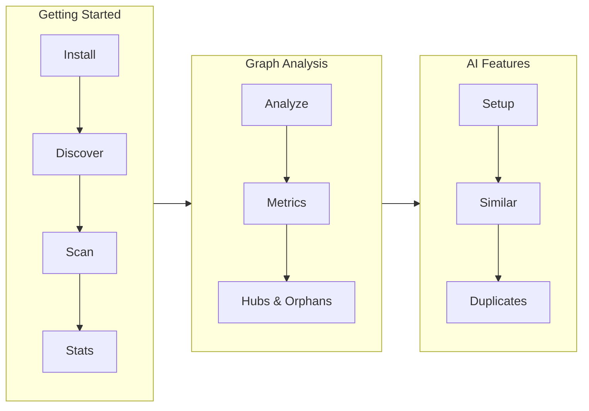

# Tutorials

Learn obs step-by-step with these progressive tutorials.

## Learning Path

## Tutorials

| Tutorial | Level | Time | What You'll Learn |
|----------|-------|------|-------------------|
| [Getting Started](getting-started.md) | Beginner | ~10 min | Install, discover vaults, scan, view stats |
| [Graph Analysis](graph-analysis.md) | Intermediate | ~15 min | Analyze graph, interpret metrics, find hubs & orphans |
| [AI Features](ai-features.md) | Advanced | ~20 min | Setup AI providers, find similar notes, detect duplicates |

## Prerequisites

- macOS or Linux
- Python 3.9+
- An Obsidian vault (any size)

## Tips

- Each tutorial builds on the previous one
- Commands show expected output so you can verify
- Use `--verbose` on any command for more detail
