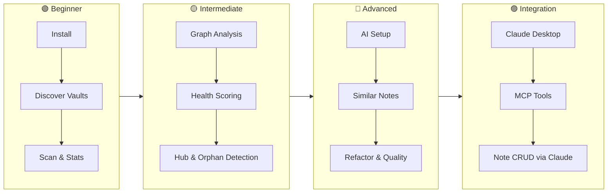

# Tutorials & Cookbook

Step-by-step guides that take you from zero to expert — with copy-paste commands and expected output at every step.

---

## Learning Path



---

## Tutorials

| Tutorial | Level | Time | What You'll Learn |
|----------|-------|------|-------------------|
| [Getting Started](getting-started.md) | 🟢 Beginner | ~10 min | Install, discover vaults, scan, view stats |
| [Graph Analysis](graph-analysis.md) | 🟡 Intermediate | ~15 min | Analyze graph, interpret metrics, find hubs & orphans |
| [AI Features](ai-features.md) | 🔵 Advanced | ~30 min | Setup AI providers, similar notes, refactor, quality |
| [Claude / MCP Integration](claude-mcp.md) | 🟣 Integration | ~20 min | Connect Claude Desktop, use all 41 MCP tools, note CRUD |

---

## Cookbook — Quick Recipes

Fast copy-paste solutions. No explanations — just the commands.

### Setup & Discovery

```bash
# Homebrew (recommended)
brew install data-wise/tap/obsidian-cli-ops
obs discover ~/Documents --scan

# Manual
git clone https://github.com/Data-Wise/obsidian-cli-ops.git
cd obsidian-cli-ops && ./install.sh
obs discover ~/Documents --scan

# iCloud vault location
obs discover ~/Library/Mobile\ Documents/iCloud~md~obsidian/Documents --scan
```

### Daily Health Check

```bash
obs                           # list all vaults
obs health MyVault            # 4-dimension score
obs analyze MyVault -v        # graph metrics + hubs
obs ai gaps MyVault           # knowledge gaps
```

### AI Quick Hits

```bash
obs ai status                           # which providers are available
obs ai similar <note_id>                # semantically similar notes
obs ai duplicates MyVault               # potential duplicates
obs ai refactor MyVault --dry-run       # preview scope (no AI calls)
obs ai refactor MyVault                 # full reorganization plan
obs ai quality MyVault                  # score all notes, worst-first
obs ai merge-suggest MyVault            # merge candidate pairs
obs ai tag-suggest MyVault --apply      # suggest + auto-apply tags
```

### Note Operations via Claude (MCP)

Ask Claude these after connecting the `obsidian-ops` MCP server:

```
"Search my research vault for causal inference"
"List the 5 most orphaned notes in MyVault"
"Create a note called 'Meeting 2026-06-15' in Research"
"Append today's summary to my daily note"
"Check vault health and list the top issues"
"Run a quality check on all notes in MyVault"
"Find notes that might be merged"
```

### JSON / Scripting

```bash
# Pretty-print vault stats
obs stats --vault MyVault --json | python3 -m json.tool

# Show 5 worst-quality notes
obs ai quality MyVault --json | python3 -c "
import json, sys
notes = json.load(sys.stdin)['notes']
for n in notes[:5]: print(f\"{n['score']:.2f}  {n['title']}\")
"

# Filter refactor suggestions by category
obs ai refactor MyVault --json | python3 -c "
import json, sys
plan = json.load(sys.stdin)
for s in plan['suggestions']:
    if s['category'] in ('archive', 'merge-folder'):
        print(f\"[{s['category']}] {s['description']}\")
"
```

### Vault Cleanup Pipeline

```bash
obs health MyVault                          # 1. diagnose
obs ai refactor MyVault --dry-run           # 2. preview scope
obs ai refactor MyVault                     # 3. full plan
obs ai merge-suggest MyVault --threshold 0.85  # 4. merge candidates
obs ai tag-suggest MyVault --apply          # 5. auto-tag
obs analyze MyVault                         # 6. re-check
```

---

## Prerequisites

- macOS or Linux, Python 3.9+
- An Obsidian vault (any size)
- For AI tutorials: at least one AI provider — see [AI Setup Guide](../ai-setup.md)
- For Claude MCP tutorial: Claude Desktop installed

!!! tip "Build up gradually"
    The tutorials build on each other. Recommended order: Getting Started → Graph Analysis → AI Features → Claude MCP.
