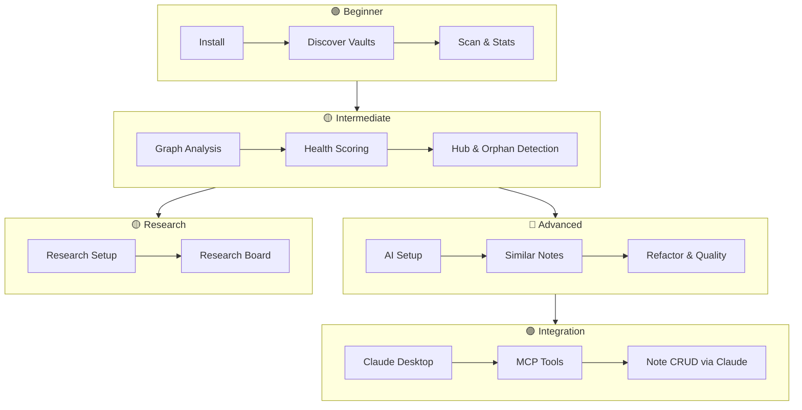

# Tutorials & Cookbook

Step-by-step guides that take you from zero to expert — with
copy-paste commands and expected output at every step.

---

## Learning Path

---

## Tutorials

| Tutorial | Level | Time | What You'll Learn |
|----------|-------|------|-------------------|
| [Getting Started](getting-started.md) | 🟢 Beginner | ~15 min | Install, discover, scan, health, board, AI, research, Claude MCP |
| [Vault Management](vault-management.md) | 🟢 Beginner | ~10 min | Inspect, rename, and safely delete vaults (index-only) |
| [Graph Analysis](graph-analysis.md) | 🟡 Intermediate | ~15 min | Analyze graph, interpret metrics, find hubs & orphans |
| [AI Features](ai-features.md) | 🔵 Advanced | ~30 min | Setup AI providers, similar notes, refactor, quality |
| [Claude / MCP Integration](claude-mcp.md) | 🟣 Integration | ~20 min | Connect Claude Desktop, use all 42 MCP tools, note CRUD |
| [Research Domain Setup](research-setup.md) | 🟡 Intermediate | ~15 min | Connect Zotero, PDFs, courses, and manuscripts (`obs research`) |
| [Research Board](research-board.md) | 🟡 Intermediate | ~10 min | Render the deterministic manuscript/program dashboard from atlas state |
| [Board Sync Workflow](../cookbook.md#board-sync-workflow) | 🟡 Intermediate | ~5 min | Weekly action board, launchd automation |
| [Workflow Decision Guide](../cookbook.md#which-workflow-should-you-use) | 🟢 Beginner | ~2 min | Pick the right workflow for your task |

!!! tip "Interactive CLI tutorial"
    Prefer learning inside the terminal? `obs research learn <getting-started|medium|advanced>`
    walks you through the same material step-by-step with live commands. See
    [CLI Reference](../cli-reference.md#obs-research-learn).

---

---

## Cookbook

For task-based recipes, copy-paste commands, and automation patterns, see
the [Cookbook](../cookbook.md). It covers first-time setup, AI analysis,
vault management, graph analysis, scripting, Claude integration, board
sync, and research workflows — all organized by task.

## Prerequisites

- macOS or Linux, Python 3.9+
- An Obsidian vault (any size)
- For AI tutorials: at least one AI provider — see [AI Setup Guide](../ai-setup.md)
- For Claude MCP tutorial: Claude Desktop installed

!!! tip "Build up gradually"
    The tutorials build on each other. Recommended order:
    Getting Started → Graph Analysis → AI Features → Claude MCP → Research Setup → Research Board.
