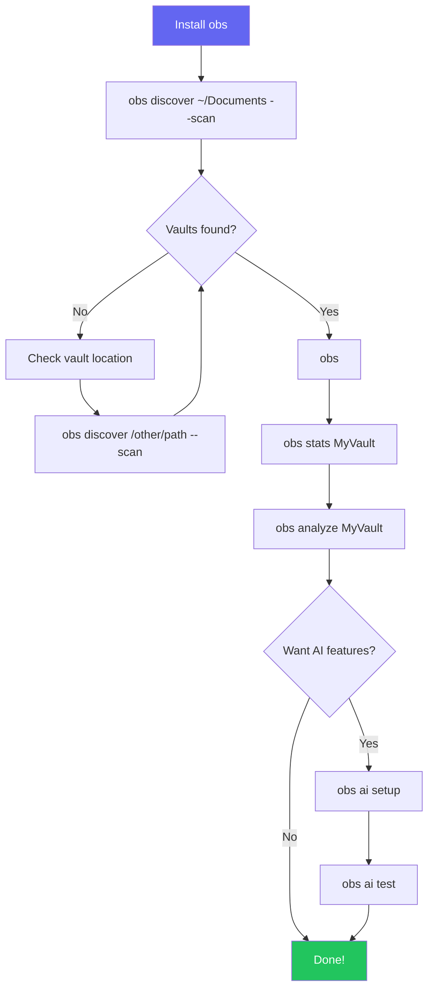
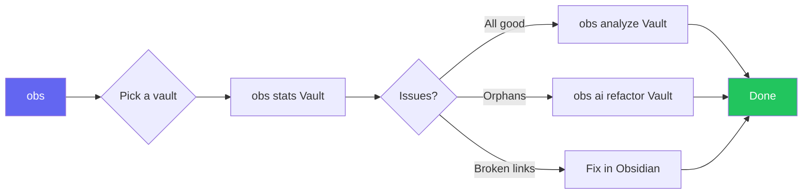
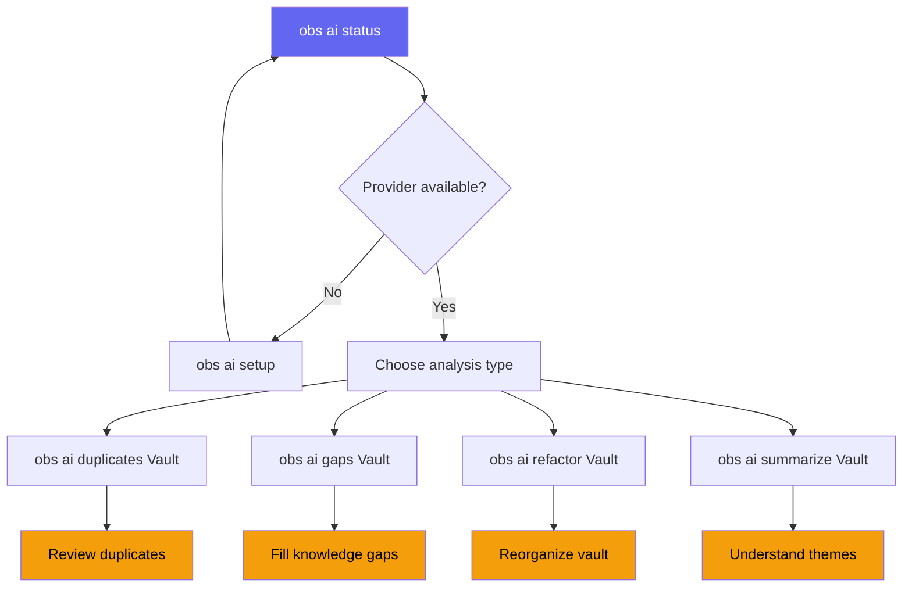
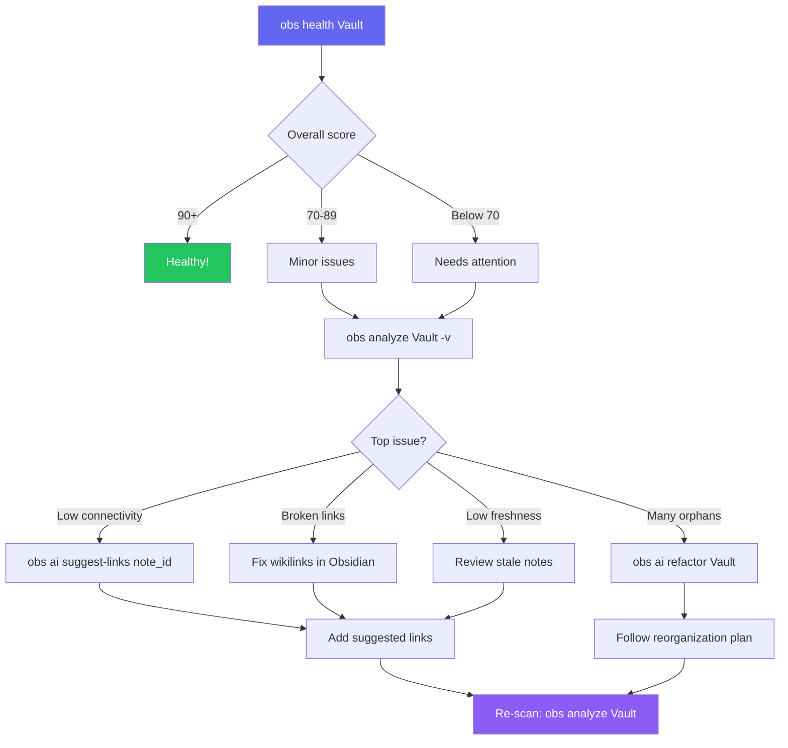
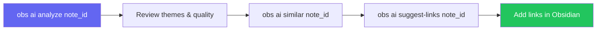
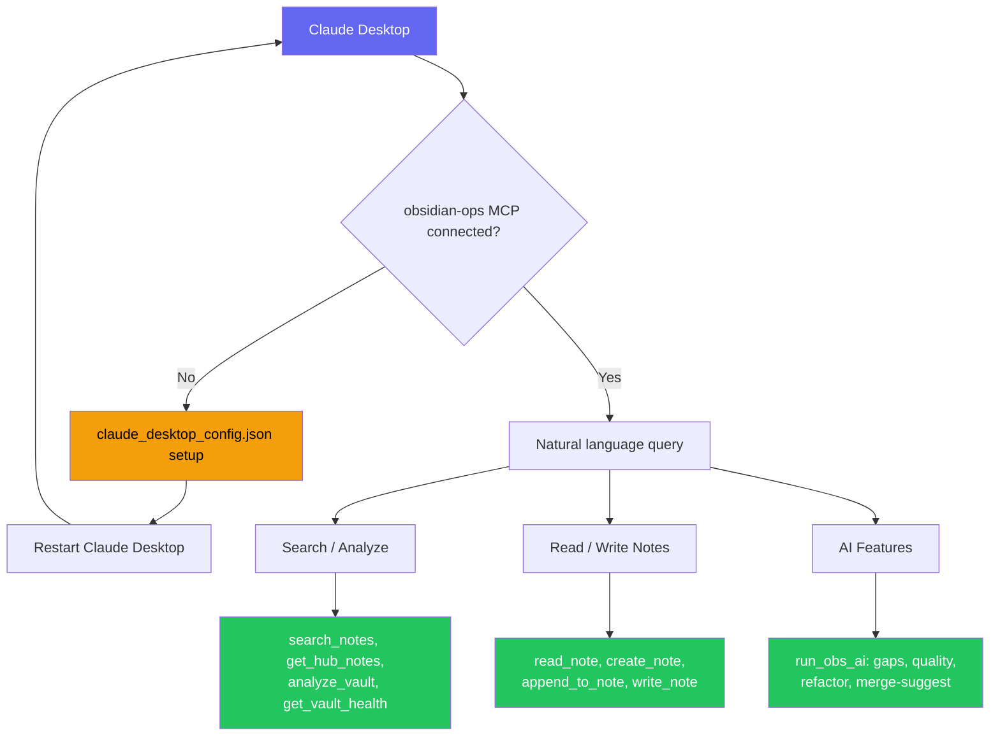

# Visual Workflows

> **TL;DR** (30 seconds)
> - **What:** Visual diagrams showing how `obs` commands fit together
> - **Why:** See the big picture before diving into individual commands
> - **How:** Follow the flowcharts — each box is a command you can run
{ .tldr }

---

## :wave: Onboarding Workflow

First time using `obs`? Follow this path:

---

## :sun_with_face: Daily Usage Workflow

Your typical day with `obs`:

!!! tip "Make it a habit"
    Run `obs health MyVault` once a week to catch issues early. Add it to your weekly review workflow.

---

## :robot: AI Analysis Pipeline

How AI features work together for deep vault analysis:

??? info "AI commands are read-only"
    AI commands analyze and suggest — they never modify your vault files. You decide what to act on.

---

## :heart: Vault Health Check Workflow

Systematic health check for any vault:

---

## :link: Note-Level Analysis Workflow

Deep dive into a single note:

---

## :robot_face: Claude / MCP Workflow (v3.3.0)

Use Claude Desktop to query and edit your vaults in natural language:

!!! tip "5-minute setup"
    See [Claude Integration](claude-integration.md) to connect `obs` to Claude Desktop.
    Once connected, all 42 MCP tools are available in every Claude conversation.

---

## :arrow_right: Next Steps

| Want to... | Go to |
|------------|-------|
| Start using obs | [ADHD Quick Start](adhd-quick-start.md) |
| See all commands | [CLI Reference](cli-reference.md) |
| Copy-paste recipes | [Cookbook](cookbook.md) |
| Set up AI | [AI Setup Guide](ai-setup.md) |
| Connect Claude Desktop | [Claude Integration](claude-integration.md) |
